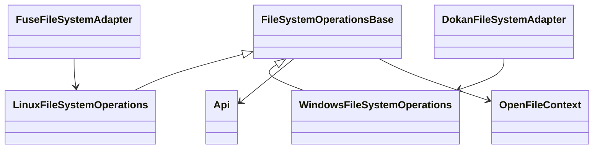

# Linux 機能の Windows 展開設計

> **道順**: [docs/README.ja.md](../README.ja.md) › **本書**
>
> **この doc が正である範囲**: Windows (Dokan) 実装の**設計と as-built**、および Linux 機能を
> Windows へ展開する段取り。実測で分かった Windows 固有の挙動もここに書く。
>
> **隣接する doc とその担当範囲**:
>
> | doc | そちらに書くもの |
> |---|---|
> | [../Assign.ja.md](../Assign.ja.md) | **利用者向け仕様** (CLI・前提・既知の制限) |
> | [handle-context.ja.md](handle-context.ja.md) | ハンドル文脈の共通化 (段階 A〜D)。§共通クラスと責務 の行き先 |
> | [permission-interop.ja.md](permission-interop.ja.md) | ACL / 権限の Linux↔Windows 相互運用 |
> | [../tests.ja.md](../tests.ja.md) | Windows スイートの件数・実行方法 |

設計案である。
**本書のうち「Windows 基礎」段は 2026-09-19 に実装・実機検証済** (下 §実装ステータス)。**それ以外の提案 (共通クラスの抽出・所有者導出・native 拡張ほか) は未実装**で、性能も未測定である。現行仕様は [Assign.ja.md](../Assign.ja.md) を参照する。

## 実装ステータス (as-built)

本書の「実装順」表の **Windows 基礎**段のうち、**仕様判断を要しないものを実装済み** (`src/dokan` / `src/assign` / `tests/windows` のみ・Core 無変更)。
検証は Windows 実機 (Dokan 2.3.1 / PG は `pgsql_server` の `pgfs` スキーマ・Citus rf=2・audit on) で
**e2e / cross-client / write-back (`mount.write_back` on) を 3 回連続で全緑**。

> **件数はここに書かない。正は [tests.ja.md](../tests.ja.md)。** 当時は e2e 30 / cross-client 6 /
> write-back 6 だったが、**その後スイートも件数も増えている** (ある時点で e2e 38 / cross-client 10)。
> **ここに数字を残すと「Windows のテストは 30 件」と読まれる。**

| # | 入ったもの | 該当 | 検証 |
|---|---|---|---|
| 1 | **CREATE_NEW の排他化** — `FileMode.CreateNew` が `Api.CreateFile(..., exclusive: true)` に到達。衝突判定をローカルの不存在チェックから **DB の一意制約**へ移した | `FileSystem.CreateFile` / `DoCreate` | `test_createnew_exclusive` (2 回目が失敗し、敗者が勝者の内容を壊さない) + **cross-client 6 ラウンドで成功は常に 1 件** ([crossclient.ps1](../../tests/windows/crossclient.ps1)) |
| 2 | **allocation と EOF の分離** — `SetAllocationSize` は縮小のみ truncate、拡大は EOF を変えない no-op 成功 | `FileSystem.SetAllocationSize` | `test_allocation_size_does_not_extend_eof` (`FileStreamOptions.PreallocationSize` 1 MiB → EOF は 4 バイトのまま) |
| 3 | **通知パスの絶対化** — `Mounted` が申告する実マウント先を保持し、`NotifyUpdate` に `P:\dir\file` を渡す (従来は mountpoint の無い `\dir\file`)。bool 戻り値も失敗ログに使う | `FileSystem.Mounted` / `ToNotifyPath` / `NotifyUpdate` | ドライバ API の契約 (「マウント先を含む絶対パス」) に合わせた。**2 マウントでの可視性は実測済** (create / 上書き / delete / 置換 rename が数百 ms で追随)。Explorer のイベント種別までは未検証 |
| 4 | **flush の fail-open 解消** — `FlushFileBuffers` が同期対象を解決できないときに Success を返さない (FileNotFound + Error ログ) | `FileSystem.FlushFileBuffers` | Linux の Phase 0 ② と同じ扱い。e2e 中の発火は 0 件 |
| 5 | **truncate 戻り値の確認** — `FileMode.Create` / `FileMode.Truncate` で `TruncateData` の失敗を成功にしない | `FileSystem.CreateFile` | 既存 e2e で回帰なし |
| 6 | **同一対象 rename のガード** — 同一パス / 同一 inode への `MoveFile` を no-op 成功にし、置換削除へ入れない | `FileSystem.MoveFile` | `test_rename_same_path_noop`。Core 側の防波堤 (`Api.Rename` の同一 id 判定) は Linux 側で実装済 |
| 7 | **ディレクトリ意味論の遵守** — ディレクトリ要求で通常ファイルを開かせない (`NotADirectory`) | `FileSystem.CreateFile` (Open / OpenOrCreate) | 実測で Windows は「まずディレクトリとして開いてみる」探りを打つ。`NotADirectory` を返すと呼び出し元がファイルとして開き直す |
| 8 | **終了コードの喪失報告** — `assign.pgfs` が `FileSystem` 破棄 → `api.Dispose()` → `UnflushedAtShutdown > 0` で **exit 4** (mount.pgfs と同契約)。Ctrl+C と `Unmounted` の二重停止も防止 (**停止シグナルの購読位置は #19 で Program 側へ移した**) | `Assign/Program.RunDokanMountAsync` / `FileSystem.RequestStop` | 正常アンマウントで exit 0 + 内容が残ることを [writeback.ps1](../../tests/windows/writeback.ps1) `test_wb_graceful_unmount_persists` で確認。**exit 4 の実発火**は #19 の打ち切り実験で確認済 (未 flush 1057 件 → exit 4) |
| 9 | **監査主体の取得位置の修正** — 呼び出し元を `CreateFile` で確定してハンドル (`OpenFile`) に載せ、以降の変更操作はそれを使う | `FileSystem.CaptureRequestor` / `ApplyAuditContext` / `OpenFile` | 下記参照 |
| 10 | **WRITE_THROUGH の配線** — `FileOptions.WriteThrough` 付きのハンドルを `OpenFile` に持ち回り、**WriteFile ごとに完全バリア** (`Api.FlushInode`) を張る | `FileSystem.CreateFile` / `.WriteFile` / `OpenFile.WriteThrough` | [writeback.ps1](../../tests/windows/writeback.ps1) `test_wb_writethrough_survives_kill` (flush も close もせず強制終了 → 内容が残る。**negative control 付き** = バリア無しの書き込みは失われる) |
| 11 | **マウント先の事前チェック** — 使用中のドライブレター / 存在しないディレクトリ / 空でないディレクトリを起動前に弾き、空き候補を出す | `Assign.Program.DescribeUnusableMountPoint` | 手動確認 (メディア無し CD-ROM の `Q:` で「既に使われています」+ 空き一覧 / 存在しないディレクトリで「ディレクトリがありません」) |
| 13 | **属性変更の冪等化** — `SetFileAttributes` は実質変更が無ければ DB を触らず成功で返す | `FileSystem.SetFileAttributes` / `.IsAttributeChangeNoop` | `Remove-Item` は削除前に ReadOnly 落としの `SetFileAttributes` を呼ぶため、**flush が恒久失敗している pending inode を消せなくなっていた** (= 唯一の回復手段が Windows から使えない)。ドットファイルは heuristic 抑止の保存が必要なので no-op にしない (`test_dotfile_unhide_sticks` で回帰) |
| 14 | **例外を NTSTATUS に落とす** — `CreateFile` / `SetFileAttributes` で Core の例外を捕まえる | `FileSystem.CreateFile` (`CreateFileCore` に分離) | 従来は DokanNet が汎用エラーに丸め、ログに `Throw` としか残らなかった (write-back のエラーステート中の create で観測) |
| 18 | **エラーステート中の破壊操作を呼び出し元に断る** — `Api.CanDestroy` を `DeleteFile` / `DeleteDirectory` / `SetEndOfFile` / `SetAllocationSize`(縮小) / `MoveFile`(置換) の 5 箇所で見て `DokanResult.Error` を返す | `FileSystem.BlocksDestroy` ほか | `test_meta_error_state_blocks_persisted_delete` (`blocked=True` かつファイルが残る)。**`Cleanup` は void なので、そこまで行かせると「消えていないのに成功」になる** |
| 17 | **byte-range lock をドライバに任せる** — `DokanOptions.UserModeLock` を外し、`LockFile` / `UnlockFile` は `NotImplemented` を返す | `FileSystem.Run` / `.LockFile` / `.UnlockFile` | `test_byte_range_lock_enforced` (2 本目のハンドルの `Lock` が `IOException`・`Unlock` 後は取得できる)。**以前は常に Success = 取れていないロックを取れたと嘘をついていた**。別マウント間は未対応 |
| 16 | **所有者の導出 (案 B)** — 新規 inode の `uname` は **要求元の User SID** を `UnameOf` で正規化した名前、`gname` は **親ディレクトリから継承**。取得できなければ `fallback_uname`/`gname` + Warning で、**実行プロセスの user には化かさない** | `FileSystem.CaptureCaller` / `DoCreate` / `WindowsUserResolver.FallbackUname` | e2e に `test_new_file_owner_is_requestor` / `test_new_file_inherits_parent_group` を追加 (27 → 30 → **32 件**)。`.Owner` ではなく `.User` を使う (昇格プロセスだと Administrators に化ける) |
| 15 | **ローカル削除も `NotifyDelete`** — 自分のマウントで消した対象も Windows へ通知 | `FileSystem.Cleanup` / `.NotifyLocalDelete` | 別プロセスがハンドルを持っていた削除後のキャッシュ残留が **3 回中 2 回 → 1 回**に減った (完全解消はしない・下の実測参照) |
| 12 | **リモート削除の通知** — 消えた対象は `NotifyUpdate` では invalidate されないので、再取得して消えていれば **`NotifyDelete`** を撃つ | `FileSystem.PropagateRemoteChange` / `.NotifyDeleted` | cross-client `test_x_delete_visible_from_peer` が **3 回連続緑** (この修正前は 3 回中 1 回 FAIL) |
| 19 | **停止シグナルの段階化 (B-12 の Windows 配線)** — `Console.CancelKeyPress` の購読を `FileSystem.Run()` から **`assign.pgfs` 側へ引き上げ**、1 発目=アンマウント要求 / 2 発目=**`Api.AbandonFlush()`** / 3 発目以降=既定の即時終了。従来は 1 発目で `Run()` を抜けた瞬間に購読が外れ、**shutdown flush の最中が無防備** (2 発目 = 即死で喪失レポートも墓標も残らない) だった | `Assign.Program.RunDokanMountAsync` / `FileSystem.RequestStop` | 手動 (pending 1200 件・期限 600 秒 → Ctrl+Break 2 発目から **152 ms** で打ち切り、喪失レポート + `exit 4` + 墓標 `unflushedLoss: 1057`)。自動テストは書いていない (Linux B-12 と同じ判断)。**`AttachConsole` 経由の `CTRL_C_EVENT` は相手に届かない / `CTRL_BREAK_EVENT` は届く**。詳細は [metadata-write-back-reviews.ja.md §B-12 の Windows 配線](metadata-write-back-reviews.ja.md) |

### 削除の可視性 — 2026-09-20 の再測で「クロスクライアントの問題ではない」ことが分かった

`crossclient.ps1` の `test_x_delete_visible_from_peer` が落ちるようになったので mount ログで追ったところ、
**通知経路は健全で、詰まっていたのは A 側のローカル削除だった**。

```
00:29:23.823  A の write 通知 → B から見える (Wait-Visible OK)
   … 15.0 秒: B が 320ms 周期で列挙、毎回 x_del.txt を返す (Wait-Gone の budget を消費) …
00:29:39.343  SetFileAttributesProxy : \xtest\x_del.txt   ← Remove-Item の ReadOnly 落とし
00:29:39.345  DeleteFileProxy         Return : Success    ← 削除が FS に到達したのはここ
00:29:40.290  NotifyDelete(file): R:\xtest\x_del.txt      ← 通知は削除の 0.95 秒後 = 速い
```

**`Remove-Item` は即座に返るが、Windows は `DeleteFile` を保留 (`DeletePending`) するだけ**で、
**最後のハンドルが閉じるまで FS のコールバックを呼ばない**。誰がハンドルを持っているかは
Explorer / インデクサ / Defender 次第で、実測では **15 秒以上**開くことがあった
(ログに `\autorun.inf` の open が出る = `RemovableDrive` 指定でシェルが舐めに来ている)。
テストはその間の B を見ていたので、**「まだ A でも消えていないもの」が B から見えることを
クロスクライアント可視性の失敗として数えていた**。

**テスト側を直した**: `Remove-Item` をやめ、**`FileOptions.DeleteOnClose` で開いて閉じる**
(削除はこちらが持つハンドルの close で確定する) + **まず A 側で消えたことを確認**してから B を待つ。
**5 回連続緑**になった。修正前は連続実行で 5 回中 3 回落ちていた。

> **測定の教訓**: 失敗率だけで回帰かどうかを判断しない。ベースライン でも 1/5 落ちており、
> 率の差 (20% ↔ 75%) は **publish 直後の Defender スキャンなど外的負荷**で動く。機構をログで見るまで
> 「自分の変更が悪化させた」と読める状態だった。

**`test_touch_unlink` (単一マウント e2e) も同じ機構だった** (確認済み)。`Assert-Absent` は
既に**親ディレクトリの列挙で 10 秒ポーリング**しているのに落ちていた = **Windows が `DeleteFile` を
発行するまで 10 秒以上かかる**ケースがあるということ。同じく `DeleteOnClose` 化して **5 回連続緑**。
これで「3 回に 1 回落ちる既知 flake」は **2 件とも同じ 1 つの原因**に帰着し、解消した。

> **結論**: 「削除の可視性の残件」は **FS 側の問題ではなくテスト方法の問題**だった。pgfs は
> `DeleteFile` コールバックを受けたら即座に消して通知しており (実測 0.95 秒で他マウントへ着弾)、
> 遅いのは **Windows がそのコールバックを呼ぶまで**である。`NotifyDelete` 以外の手を FS 側に
> 探す必要は無い。**アプリから見た「削除したのにまだ見える」窓は残る**が、これは NTFS でも同じ
> Windows のセマンティクスであり、pgfs 固有ではない。

**この過程で実バグを 1 件直した**: `src/dokan/src/Logger.cs` の `Debug(string, params object[])` だけ
`[message, ..args]` の展開が抜けており、`Logger.Log(Level.Debug, message, args)` が
`Log(Level.Enum, params object?[])` に `[message, args]` として渡っていた。結果、**Dokan 層の複数引数
`Logger.Debug` がすべて `System.Object[]` としか出ていなかった** (`Info` / `Warn` / `Error` / `Fatal` は
正しく展開していたので Debug だけの取りこぼし)。これが無いと上の切り分けはできなかった。

### 実装中に判明した事実 (実測)

- **`GetRequestor` は CreateFile の中でしか成功しない**。従来は `Cleanup` / `MoveFile` / `SetFileAttributes` / `SetFileSecurity` の先頭で呼んでいたため
  `Invalid token for impersonation - it cannot be duplicated` で失敗し、**Windows の監査行は呼び出し元がすべて null** だった
  (e2e 1 周で失敗 **3400 件**)。修正後は同区間で失敗 0 件、`{prefix}audit` に
  `caller_uname` / `caller_domain` が入ることを DB で確認 (create/delete/chmod/rename/chown)。
  → 本書 §create・所有者・監査 の 1 / 5 の前提が実機で裏取りされた。**所有者 (uname/gname) の導出はまだプロセス既定のまま**で、これは別段階。
- **削除の可視性には窓がある**。`Remove-Item` が復帰した直後は `Test-Path` がまだ true を返し、不在が見えるまで実測 **≈0.6 秒**
  (削除の実体は `Cleanup` 契機 + Citus の DELETE ≈100 ms + Windows 側のキャッシュ)。
  これは Dokan の delete-on-close 意味論の範囲内だが、**テストは 1 回の `Test-Path` で判定してはいけない**
  (`tests/windows/e2e.ps1` の `Assert-Absent` を有界リトライ + 列挙の二重確認に変更した)。
- `OpenFile` は本書 §共通クラスと責務 の `OpenFileContext` の **Windows 側の先行実装**。現状は「解決済み inode + 監査主体」だけを持ち、
  安定識別子・アクセスモード・同期方針はまだ持たない。共通化のときはこのクラスが派生側に収まる。

### cross-client の実測 (2026-09-19・[crossclient.ps1](../../tests/windows/crossclient.ps1) 6 件)

同じ DB-FS を 2 つの `assign.pgfs` (P: と R:) でマウントして測った。**6/6 PASS を 3 回連続** (削除の通知を `NotifyDelete` に直した後。それ以前は delete の 1 件が 3 回中 1 回落ちていた)。

- **排他は DB で決まっている**: 同時 `CREATE_NEW` 6 ラウンドすべてで成功は 1 件のみ、勝者の内容も無傷。
  → 上記 1 (exclusive: true) が cross-client でも効いていることの実証。同時 `mkdir` も実体は 1 つ。
- **可視性は `database.notify_enabled` に完全に依存する** (v0.2.1 から既定 true)。false では、他マウントの
  create / 上書き / delete / 置換 rename が**いつまでも見えない** (4 件とも古いまま。`InodeCache` と read キャッシュは
  マウントごとに独立で、invalidate は LISTEN/NOTIFY でしか来ない)。`--notify` を付けた 2 マウントでは 4 件とも
  数百 ms で追随した。→ **Windows で複数マウントを運用するなら notify は事実上必須**。この事実は
  [Assign.ja.md](../Assign.ja.md) / [tests/windows/README.ja.md](../../tests/windows/README.ja.md) にも書いた。
- 副次: 既存の別ドライブ (この環境では `Q:`) を指定すると Dokan は
  `Something's wrong with the Dokan driver` という汎用例外で失敗する。→ **assign に事前チェックを入れた** (上記 11)。
  判定は `Directory.Exists` では**できない**点が落とし穴で、メディア無しの CD-ROM や未接続のリムーバブルは
  「ルートが存在しないのにレターは占有されている」ため `DriveInfo.GetDrives()` で見る必要がある。
- 削除の可視性は `NotifyUpdate` だけでは取れない: 消えた対象は属性変更として扱われ、相手側の
  Windows キャッシュにエントリが残る。**再取得して消えていれば `NotifyDelete`** を撃つ形にして解消した (上記 12)。
  種別 (ファイル / ディレクトリ) は消えた後だと分からないので、ファイル → ディレクトリの順に試している
  (Core の通知 payload に op / 種別を載せるのが本筋。§通知 の候補)。

### metadata write-back / B-1 ノブの実測 (2026-09-19・[wbmeta.ps1](../../tests/windows/wbmeta.ps1) 4 件)

A = `defer` + write-back、B = write-through の **実 2 マウント**で測った (Linux 側は psql の fault injection)。**3 passed / 1 failed**。

- ✅ **B-1 の要件は満たされている**: A が pending のまま作った名前を B が占有 → **A の明示バリアは失敗し、占有者 B の内容は無傷**。
  ログでも `O_EXCL で作成した inode ... の名前を既存 inode ... が占有しています` で flush が繰り返し失敗し、**占有者を消していない**ことを確認した。
- ✅ **close-no-flush の契約**: A が作って close しただけのファイルは強制終了で失われる (ファイルごと残らない)。
- ✅ **defer でも同一マウント内の `CreateNew` 排他は維持**。
- ❌ **`unlink` で回復できない (Core 側の未修正)**: 敗者側で削除すると pending は消える (unmount の exit も 0 に戻る) が、
  **エラーステートの latch が解けず**、後続の create が `-EIO` のまま (`write-back: flush が連続失敗しているため新規の書き込み / 作成を拒否します`)。
  Linux 側に報告済み。Windows 側のテストは契約どおり FAIL させたまま残している。
- **exit 4 は Windows では呼び出し元に届く**: `assign.pgfs` は前景プロセスなので、喪失を残した unmount が実際に **exit 4** を返すのを確認した
  (Linux の `mount.pgfs` はデーモン化していて親が先に 0 で終わるため届かない — B-2 で DB の墓標へ移された)。

### 所有者 / グループの決め方 (決定)

| 項目 | 決定 | 理由 |
|---|---|---|
| `uname` | **要求元の User SID** (`WindowsIdentity.User`) を `WindowsUserResolver.UnameOf` で正規化 (`DOMAINAlice` → `alice`) | 保存形式は [permission-interop.ja.md](permission-interop.ja.md) の「名前のみ・SID/UID は持たない」規約どおり。`.Owner` は昇格プロセスだと `Administrators` になり得るので使わない |
| `gname` | **親ディレクトリから継承** (案 B) | Windows の token primary group は実質 `Domain Users` / `None` で権限判定にも使われない。継承なら「同じツリーは同じグループ」になり mode の group ビットが意味を持つ。**Linux の既定 (作成者の primary group) とは意図的に違う** |
| 取得失敗時 | `file_system.unknown_name` (`(unknown)`・v0.2.1〜。旧 `fallback_uname` / `fallback_gname` は廃止) + Warning | create を失敗させるほうが実害が大きいので作成は続ける。**v0.2.1 で権限の判定が入った**ので、`(unknown)` の所有者は誰とも一致せず、そのファイルは other の権利で判定される ([permission-interop.ja.md §Windows の判定](permission-interop.ja.md)) |
| ノブ | **作らなかった** | `mount.owner_from_requestor` を検討したが、Field 追加は `src/core/src/Config/Schema.cs` = Linux 側の担当範囲。既定 on 相当の挙動のみ実装し、退避路が要るなら Core 側に Field を足してもらう |

**落とし穴**: 正規化でドメインが落ちるので **`CORP\alice` と `LOCAL\alice` は同じ `alice` になる**。読み取り投影では以前からそうだったが、**書き込み (所有者の決定) でドメインが潰れるのは今回が初めて**。ドメイン環境での名前解決 (レイテンシ/失敗率) は未検証で PoC 対象。

### native link (hardlink / junction / symlink) の到達性 PoC — **作成不可・読みも壊れる**

**API 面**: `IDokanOperations2` の 25 メンバに **link 系のコールバックが 1 つも無い**。reparse 関連は
`FileSystemFeatures.SupportsReparsePoints` / `NtStatus.Reparse` / `WIN32_FIND_DATA.dwReserved0` (reparse タグ) が
型としては存在するが、**reparse データを get/set する入口が無い**。

**作成の実測** (P: 上で実行。4 通りとも失敗し、しかも理由が別々):

| 操作 | 結果 |
|---|---|
| `mklink /H` (hardlink) | `The parameter is incorrect` (要求が FS まで届かない) |
| `mklink /J` (junction) | `Local NTFS volumes are required to complete the operation` |
| `mklink /D` (symlink) | `The device does not support symbolic links` |
| `File.CreateSymbolicLink` (.NET) | `ERROR_INVALID_FUNCTION` |

**読みの実測** (Linux が作る形の symlink 行 = `st_mode` に `S_IFLNK` + `link_target` を psql で 1 行だけ作って確認・後で削除):

| 見方 | 結果 |
|---|---|
| ディレクトリ列挙 (`GetFileSystemEntries`) | **出てこない** (エクスプローラ / `dir` から見えない) |
| パスを直接指定した属性取得 | `ReparsePoint` / `Length = 10` / `Exists = True` (**見える**) |
| 中身を読む (`ReadAllText`) | **空文字が返る** (リンク先の内容ではない。エラーにもならない) |
| `Get-Item` の `LinkType` / `LinkTarget` | **どちらも空** (Windows はリンクとして扱わない) |

→ 列挙に出ないのは、**reparse タグを返す枠が無い** (`FindFileInformation` に `dwReserved0` 相当が無い) ため
「タグの無い reparse point」として落とされているとみられる。
**本書の「通常のリンクとして開けるとは保証しない」より悪く、実態は「列挙から消え、名指しすると空ファイルとして開ける」**。

**結論**: 現バインディングでは **作成も読みも成立しない**。[next.ja.md](../next.ja.md) 🟢 #5 (Junction) は
「Dokan 側に入口が無い」ことが確定したので、**DokanNet / Dokany への追加か WinFsp への差し替え**が前提になる。

### `du` 相当 (AllocationSize) の到達性 PoC — **返す経路が無い**

**結論: DokanNet 2.3.0.3 では FS から allocation size を申告できない**。ドライバが EOF から合成した値が返る。

- **API 面**: `AllocationSize` は **`SetAllocationSize` (入力) にしか無い**。出力構造体である
  `ByHandleFileInformation` と `FindFileInformation` には**枠そのものが無い** (`Length` = EOF だけ)。
- **実測** (`GetFileInformationByHandleEx(FileStandardInfo)` で Windows 側の申告値を直接読んだ):

| 対象 | pgfs の実占有 (`pgfs_data.total_size`) | `st_size` (EOF) | Windows が返す AllocationSize |
|---|---|---|---|
| 8 MiB 先に 1 バイトだけ書いたファイル | **1 バイト** | 8,388,609 | **8,389,120** (EOF を 512 境界へ丸めた値) |
| 4 KiB を密に書いたファイル | 4,096 | 4,096 | 4,096 |
| 空ファイル | 0 | 0 | 0 |

→ **スパースファイルで実占有の 800 万倍を申告している**。pgfs 自身は正しい値 (1 バイト) を持っており、
Linux では `st_blocks` 経由で `du` に出る ([database.ja.md §実占有バイトと st_blocks](database.ja.md))。**差は Windows 側の経路が無いことだけ**。

**選択肢**: ① DokanNet / Dokany に出力の枠を足せるか PoC (ドライバ側の改修が要る可能性) ② WinFsp は
`GetFileInfo` に `AllocationSize` があるので backend 差し替えなら解決する ③ **現状を未達として明記し続ける**。
今は ③。`du` 相当を Windows で見せるのは、**ドライバかバインディングを触らない限り不可能**という結論。

### 削除の可視性の実測 (2026-09-19)

**pgfs は消しているのに、クライアントから消えて見えないことがある**。

- 単独で測ると `Remove-Item` / `File.Delete` のどちらでも **100〜160 ms** で不在になる。
- 別ハンドルを開いた状態で消すと、**名前は列挙に残るが open は失敗** (delete-pending) → ハンドルを閉じると消える = 正しい挙動。
- ところが e2e 実行中は、DB の `DELETE inode ... rows:1` が出た後も **10 秒以上、列挙に出て open もできる**状態が
  **3 回に 1 回**起きる。ログにはその間 FS への問い合わせが 1 件も無い = **Windows クライアント側の FCB キャッシュが答えている**
  (AV / インデクサの並行 open が FCB を生かしているとみられる)。ローカル削除でも `NotifyDelete` を撃つようにして頻度は下がったが解消しない。
- → `tests/windows/e2e.ps1` の `test_touch_unlink` は **既知の間欠 FAIL** (原因は上記)。**pgfs 側の削除は DB で確認済み**。

### B-7 (エラーステート中の破壊操作) の Windows 受入 — ✅ 解決

**Core は正しく止めている**。実測 (2026-09-19・`wbmeta.ps1` の `test_meta_error_state_blocks_persisted_delete`):
エラーステート中に **persisted ファイルを A から削除しても、ファイルは両マウントから見えたまま残る** (中身も読める)。

当初は **呼び出し元に失敗が伝わりませんでした** (`Remove-Item` が成功して返る)。**Dokan の `Cleanup` は void** なので
`Api.DeleteInode` の例外をそこで握り潰しており、**「消えていないのに成功に見える」= Phase 0 ② で潰した fail-open と同じ形**でした。

→ **Core に `Api.CanDestroy(inode, out reason)` (副作用なしの述語) を入れてもらい**、
`DeleteFile` / `DeleteDirectory` / `SetEndOfFile` / `SetAllocationSize`(縮小) / `MoveFile`(置換) の **5 箇所**で見て
`DokanResult.Error` を返すようにしました。実測で `blocked=True` かつファイルが残ることを確認済み。

> **⚠ アダプタ側で `WriteBackErrorState` だけを見て判定しないこと**。pending か persisted かは Core の内部状態で、
> それを無視すると **pending の削除まで止めて B-1 の回復手段 (敗者側で unlink) を塞ぎます**。
>  `SetFileAttributes` で一度踏んだ形と同じです。判定は必ず `Api.CanDestroy` に委ねること。

### この段で**やっていない**こと (未達のまま)

`mkdir` の排他 (Core に `exclusive` の入口が無い) / **metadata write-back を on にした受入** /
handle ベースの識別 (現状はパス優先) / `UserModeLock` の見直し / native link・xattr / Windows Service。
いずれも本書の該当節が正。

### `mkdir` を同期にしない (裁定済み・「未修正」から書き換え)

**`Api.CreateDirectory` は `exclusive: false` のまま**である。長らく「Core に入口が無い = 未修正」と
書かれていたが、**これは裁定済みの仕様**であって、直すべき不具合ではない。

**裁定の理由** ([metadata-write-back-reviews.ja.md](metadata-write-back-reviews.ja.md) / ステージ 2 as-built 差分 5):
**同期化すると pending ディレクトリが原理的に生まれなくなり、祖先チェーン INSERT と dir/dir の
既存 id 採択 (Rekey) が到達不能コードになる**。`wbmeta.sh` の
`test_meta_exclusive_create_is_write_through` が **「mkdir も DB に行が無い」ことを assert していて、
「ここが変わったら気付ける」と明記**している = **裁定がテストで固定されている**。

**実際の保証**:

| モード | 同名 `mkdir` の衝突 |
|---|---|
| **既定 (`write_back_metadata` = off)** | **DB の一意制約 `(parent_id, name)` が弾く**。cross-client でも**実体は必ず 1 つ** ([crossclient.ps1](../../tests/windows/crossclient.ps1) の `test_x_mkdir_race` / Linux 側も同様) |
| **`write_back_metadata` = on** | **pending 採択で両方が成功に化ける余地が残る** (flush 時に衝突が解決される)。**`O_EXCL` の create は [B-1 のノブ](metadata-write-back.ja.md) (`write_back_metadata_exclusive_create`) で write-through に倒せるが、`mkdir` はそのノブの対象外**である |

**つまり「ロックプリミティブとして `mkdir` を使う」用途は、`write_back_metadata` を on にすると
成立しない。** `O_EXCL` の create を使うこと (そちらは既定で write-through)。

### `ReadOnly` は write ビットだけを触る (修正)

**`SetFileAttributes` が `ReadOnly` の変更で `st_mode` を 0444 / 0644 / 0755 に作り直していた。**
**ディレクトリに付けた瞬間 0444 になり、x ビットが落ちて Linux から `cd` できなくなる**のが実害で、
**Windows 側は mode を持たないので気づけない** (Linux から見て初めて壊れている形)。

| | 動き |
|---|---|
| 付ける | **write ビットを全部 (0222) 落とす**。`FileSystemUtils.IsReadOnly` は **owner / group / other の w が全部落ちているとき**に ReadOnly を立てるので (v0.2.1。それまでの `IsWritable` も「どれかに +w があれば書ける」だった)、owner だけ落としても Windows からは ReadOnly に見えない |
| 外す | **owner の write (0200) だけ**戻す |

**実測 (2026-09-21・pgsql_server)**: ディレクトリ `0755` → ReadOnly → **`0555`** (x が残る) → 解除 → **`0755`** (完全に往復)。
修正前は `0755` → **`0444`** → `0755` で、**RO の間だけ traverse できない**状態だった。

**残る割り切り**: **group / other に write があった mode は、往復でその 2 つを失う**。
POSIX 側に「元の write ビット」を覚える場所が無いため (記憶するなら win-attrs の xattr に足すことになる)。
**Windows から作られる mode (0644 / 0755) では起こらない**ので、いまは割り切っている。

**回帰**: [e2e.ps1](../../tests/windows/e2e.ps1) の `test_readonly_dir_keeps_execute` (37 → **38 件**)。
**投影された ACL に実行権が残っているか**で見る (Windows から mode は見えないため)。
**古い実装に当てて落ちることを確認済み。**

#### クロス OS の実測 (2026-09-21・Windows で立てて Linux から確かめた)

**Windows (pgsql_server の `pgfs`) で ReadOnly を立てたディレクトリを、linux_client から同じ DB に
マウントして確かめた**。**「cd できなくなる」は `-o default_permissions` を付けたときの話**である
(既定では pgfs も カーネルも mode を強制しないため、壊れた mode のまま素通りする):

| マウント | `st_mode` | `cd` |
|---|---|---|
| 既定 (`default_permissions` **なし**) | 0444 (修正前の値) | **通る** — mode は強制されない |
| **`-o default_permissions`** | **0444 (修正前の値)** | **`許可がありません`** ← 実害 |
| **`-o default_permissions`** | **0555 (修正後)** | **通る** (中の読みも OK) |

**つまり既定のマウントでは「壊れた mode が静かに残る」だけで、`-o default_permissions` を付けた
瞬間に traverse できなくなる**。**mode を保存・再現するツール** (`tar` / `rsync -p` / バックアップ) にも
そのまま乗る。**「すぐには症状が出ないが記録が壊れている」種類の不具合**だった。

> **最初この節に「Linux から `cd` できなくなる」と条件抜きで書いたが、実測したら既定構成では
> 再現しなかった**ので直した。**`default_permissions` は opt-in** で
> ([fuse/src/FileSystem.cs](../../src/fuse/src/FileSystem.cs) の「アクセス可否判定は
> マウント時の `default_permissions` でカーネルに委ねる」)、それを付けない限り mode は効かない。

### Windows の `FileIndex` を `data_id` 由来にした (2026-09-21・実測)

**`ByHandleFileInformation.FileIndex` に `inode.Id` を入れていたので、ハードリンクの兄弟が
「別のファイル」と判定されていた。** FUSE の `st_ino` と**同じ式**に揃えた。

**実測** (Windows からは native hardlink を作れないので、**psql で同じ `data_id` を指す 2 本目の名前を
作って**確認。`negcache` と同じ手口):

| | a.txt | b.txt (同じ実体) |
|---|---|---|
| **変更前 (`inode.Id`)** | 28639 | **28640** ← `nlink = 2` なのに別物 |
| **変更後 (`data_id` 由来)** | 9223372036854817145 | **9223372036854817145** (一致) |

- **式は `data_id | 0x8000_0000_0000_0000`** — [FUSE の `FillStat`](../../src/fuse/src/FileSystem.cs) と同じ。
  **同じファイルが両 OS で同じ値**を返す。
- **最上位ビットは名前空間のタグ**である。`inode.id` と `data_id` は**別のシーケンス**で
  どちらも 1 から始まるので、生の数字だと「data_id 5 のファイル」と「inode 5 のディレクトリ」が
  衝突する。**この値は DB に保存しない** (返すときに計算するだけ)。
- **`FileIndex` は `long` (符号あり) なので C# 上は負値**になるが、**Windows は 64 ビットの不透明値として
  素通しする** (実測で確認)。POSIX の `st_ino` は `ulong` なので同じビット列が巨大な正の数に見える。
- **誕生から不変**である。`data_id` は **create で確定**し (`Api.CreateFile` が採番だけ先に取る)、
  **`truncate -s 0` でも `{prefix}data` の行を消さない**ので、**最初の write を跨いでも値が変わらない**
  (実測: 空ファイル 9223372036854817081 → write 後も同じ)。詳細は
  [data-id-lifecycle.ja.md](data-id-lifecycle.ja.md)。
- **実体を持たないもの (ディレクトリ / symlink) は `inode.Id` のまま**。

**テスト**: [e2e.ps1](../../tests/windows/e2e.ps1) の `test_file_index_is_data_id_and_stable` (35 → **36 件**)。
① 最上位ビットが立つ (= data_id 空間) ② **最初の write を跨いで変わらない** ③ ディレクトリは
inode 空間、の 3 点。**`inode.Id` を返すビルドに当てて落ちることを確認済み**
(`FileIndex が data_id 由来でない (最上位ビットが立っていない): 29112`)。
**兄弟が一致すること自体は Linux 側の `st_ino` テストが持つ** (Windows からハードリンクを作れないため)。

## 推奨方針

既存の **DokanNet 2.3.0.3 を継続し、共通 Core と OS アダプタの契約を揃える**。
データ write-back、メタデータ write-back、negative cache、ライブ設定、status は既に Core に存在する。
Windows 用に同じキャッシュや SQL を作り直すのではなく、排他作成・handle・flush・終了・所有者・通知の欠けた配線を整える。

共通の動作は親クラス、OS 固有の動作は派生クラスに置く。ただし既存 FUSE コールバックは
`FuseFileSystemBase` を継承しているため、**共通の操作処理を担う親クラスとその OS 別派生クラスを Core API の上に置き、既存コールバックから利用する構成**を推奨する。
コールバック型同士の多重継承は行わない。

Linux の既知のデータ喪失を Windows でも再現することは機能同等化ではない。共通問題の修正と Linux 回帰確認を先行ゲートとする。
両 write-back 設定の既定 off は維持し、Windows で metadata on をサポート済みとするのは故障系を含む受入試験後である。

## 機能対応表（静的に確認した現状）

| 機能 | Linux / 共通 Core | Windows の現行コード | 展開時の扱い |
|---|---|---|---|
| bytea I/O・truncate・Citus 排他と retry | Api 共通 | 同じ Api を呼ぶ | 共通修正を再利用し、通常コピー・並行 I/O を Windows で再検証 |
| inode LRU / content read cache | InodeCache / ContentCache 実装済み | Api 構築時に有効 | Windows 別実装は不要。read cache=0 と小容量退避も試験 |
| negative cache | `negative_cache_ttl_ms`、既定 0、Live | 同じ GetByPath を使う | 大小文字・列挙・リモート create の可視性を確認 |
| data write-back | dirty チャンク、背景 flush、明示同期 | WriteFile → WriteData、FlushFileBuffers → FlushInode、Cleanup → CloseInode、**WriteThrough は WriteFile ごとに完全バリア** | 明示同期 / WriteThrough は [writeback.ps1](../../tests/windows/writeback.ps1) 6/6 で検証済。**Cleanup 後 I/O (paging / mmap) は未整備** |
| metadata write-back | pending-born、fsyncdir、置換 rename | CloseInode / FlushDirectory / PrepareRenameReplace は接続済み。CreateNew の排他は修正済 | **on にした受入は完了** — [wbmeta.ps1](../../tests/windows/wbmeta.ps1) が実 2 マウントで通る (2026-09-21 再走: 4 passed + 1 skip)。**skip は `unlink` による回復の観測**で、Windows が `DeleteFile` を遅延させるため**この環境では観測できない** (契約自体は Linux 側で検証済み) |
| 排他 create | FUSE O_EXCL → `exclusive:true` | ~~CreateNew でも Api.CreateFile の既定 false~~ → **修正済** | `exclusive:true` を渡して cross-client の同期排他を維持 (2 マウント実測で成功は常に 1 件)。**mkdir は意図的に非同期のまま** (§`mkdir` を同期にしない) |
| 原子的な置換 rename | Api.Rename の同一 tx | MoveFile も同じ overload | 同一対象判定、例外、既存 handle、source/target の dirty を検証 |
| UTC 時刻 | UTC 壁時計で DB 保存 | ToLocal / ToUniversalTime あり | UTC と非 UTC で再マウント・両 OS 間の往復。atime/creationTime の非更新は現行契約を明示 |
| 呼び出し元所有者 | fuse_get_context の uid/gid | DoCreate はマウントプロセスの DefaultUname/Gname | 要求元トークンから所有者・グループを導出する |
| 監査 | Core の操作時キャプチャと tx 内 INSERT | ~~各操作で GetRequestor を再取得 (全件失敗)~~ → **修正済**: CreateFile で確定し `OpenFile` に保持 | 残: 背景 flush への伝搬 (write-back on の受入時に確認) |
| 設定・status・GUI | ConfigAdmin / StatusAdmin、LISTEN、heartbeat | assign も同じ Api を起動 | CLI 再実装不要。GUI は読み取り MVP、書込み画面は共通の未実装項目 |
| df / 空き容量 | GetStatFs、5 秒 cache | GetDiskFreeSpace が利用 | require/auto/nominal、Citus rf≥2 を実機検証 |
| `du` 相当の payload 占有量 | GetOccupiedBytes → st_blocks | ByHandleFileInformation は Length のみ | ** PoC 済 = 返す経路が無い** (出力構造体に枠が無く、ドライバが EOF から合成する)。上の §AllocationSize の到達性 PoC |
| ACL / Windows 属性 | POSIX 正準ストア | SD 投影、user.win.attrs | named ACL の厳密 enforce は両側で未完成。表示とアクセス拒否を別試験にする |
| symlink / hardlink / 任意 xattr | FUSE の入口あり（hardlink に既知問題） | native 作成 API の入口なし。ADS も未対応 | 後述の拡張調査を要する。Core API の存在だけで完了扱いにしない |
| リモート変更通知 | Core cache invalidation、Linux OS 通知なし | ~~mountpoint のないパス~~ → **修正済** (実マウント先を前置・戻り値もログ) | 可視性は 2 マウントで実測済。**FileSystemWatcher のイベントは他マウント由来では 1 件も出ない** (2026-09-21 実測。ローカル操作では `Created`/`Changed`/`Renamed`/`Deleted` が出る) = **`NotifyUpdate` はキャッシュを無効化するが `ReadDirectoryChangesW` の通知は生まない**。**開いたままのウィンドウは更新されない**。完全なページキャッシュ整合は未検証 |
| 正常停止と喪失報告 | SIGINT / SIGTERM、終了時残留で exit 4 | ~~Dispose はあるが戻り値は 0 のまま~~ → **修正済** (exit 4 + 二重停止防止) | **実発火を確認済** — metadata write-back の `defer` で A が pending な create を持ち、**B が同名を `CreateNew` で占有**すると A の flush は永久に失敗する。その状態で `dokanctl /u` による**正常停止**をかけると `UnflushedAtShutdown > 0` となり **exit 4 が呼び出し元に届く**。**未 flush を残さずに止めた場合は exit 0** なので、契約として確かめられている。**`--write-back-interval-ms 0` が必須** (既定 1000 ms だと B が来る前に背景 flush が pending を実体化し、衝突が起きない)。停止処理の共通化は未実施 |
| 起動時マウント | fstab helper / daemon | 対話的 Run / Ctrl+C | 当初は対話起動、継続運用は Windows Service を別段階で追加 |
| OS 固有オプション | max_write、FUSE -o、foreground | FUSE 設定は実際には適用しない | Windows help / 起動診断で OS 対象を区別し、同名オプションを機械的に移植しない |

根拠 (**行番号は腐るのでメソッド名で参照する**): `Pgfs.Dokan.FileSystem.CreateFile` / `.DoCreate` (create)、`.Cleanup` / `.FlushOnCleanup` (cleanup)、
`.FlushFileBuffers` (flush)、`.MoveFile` (rename)、`Pgfs.Assign.Program.RunDokanMountAsync` (終了処理)、`Pgfs.Core.Api.Api` のコンストラクタ (初期化)、
`Pgfs.Core.Config.Schema` (設定)。現在の依存版は `src/dokan/Dokan.csproj` に固定されている。

## 実装方法の候補と推奨理由

| 候補 | 利点 | 制約・費用 | 判断 |
|---|---|---|---|
| Dokan の既存コールバックだけを個別修正 | 小さな差分で排他 create・終了コード・通知を直せる | 所有者・handle・エラー契約が Linux と重複し、再び差が生じる | 初期の不具合修正には適するが、最終構造にはしない |
| **共通操作クラス + OS 別派生クラス + 既存 Dokan/FUSE アダプタ** | キャッシュ・tx は Api に一元化し、close/flush/identity の意味を共有できる | 小規模な構造変更と両 OS の回帰確認が必要 | **推奨**。既存資産と「共通は親、固有は派生」の方針を両立する |
| DokanNet / Dokany の必要部分を拡張 | native symlink / allocation 等の入口を追加できる可能性 | .NET binding だけで足りるか、ドライバ側改修が必要か未検証。配布・版固定・保守費用が増す | 機能ごとの到達性 PoC 後に判断。無条件に採用しない |
| WinFsp へ Windows アダプタを置換 | 公式 API に allocation・reparse・EA の明示的な処理点がある | ドライバ・binding・ACL・通知・既存テストの移行が必要。hardlink を含む完全同等性は未検証 | 全面移行は現段階では非推奨。Dokan で必要な native 操作を提供できない場合の比較候補 |
| pgfsctl に link / xattr 等の管理操作を追加 | Core を利用して Windows から DB の同じ機能を操作できる | CreateSymbolicLink / CreateHardLink / Explorer 等の通常アプリ互換にはならない | 補助案。native 同等機能の完了条件とは別に扱う |

WinFsp の比較根拠は [公式 API](https://github.com/winfsp/winfsp/blob/master/doc/WinFsp-API-winfsp.h.md) の
GetFileInfo / SetFileSize / GetEa / SetEa / reparse 操作である。導入や依存更新は本設計では行わない。

## 共通クラスと責務（新規設計・未実装）

> **追記**: この節の前提になる「ハンドル文脈」の設計を [handle-context.ja.md](handle-context.ja.md) に切り出した。
> 段階 A〜D と未解決の論点 (ハンドル表の置き場 / 1e の同期 close 印との関係 / 削除後 I/O の契約 / ロック) はそちらが正。
> 本節の `FileSystemOperationsBase` は **段階 D** にあたる。



- `FileSystemOperationsBase`（Core 内の新規候補）: open identity、排他 create、flush/close/rename の手順、エラー分類、停止時 drain 結果の共通処理を持つ。DB SQL と dirty 台帳は既存 Api に残す。
- `LinuxFileSystemOperations`（Fuse）: 呼出し元 uid/gid、FUSE flags、errno 変換を担当する。既存 `FileSystem : FuseFileSystemBase` は薄い変換層として維持する。
- `WindowsFileSystemOperations`（Dokan）: requestor、FileMode/FileOptions、NTSTATUS、実マウント先、OS 通知を担当する。既存 `FileSystem : IDokanOperations2` が委譲する。
- `OpenFileContext`（Core 共通部 + Windows 派生部）: 安定したファイル識別子、アクセスモード、必要な同期方針、監査主体、close 状態を保持する。Windows 固有の token を Core に持ち込まず、名前・SID 文字列表現等の管理された値へ変換する。Linux の `fi.fh` は将来的にこの handle 台帳のキーとする。

パスは open 時と名前操作時の解決に使い、以降の I/O では handle の識別対象を優先する。
現在の `FileSystem.Resolve` は ハンドル (`OpenFile`) が持つ Inode オブジェクトを使い続けるため、
リモート invalidate 後も古い Size / DataId 等が残り得る。**安定識別子と更新可能な属性キャッシュを分ける**。
削除後 I/O のための生存管理は単なる GetById の再取得では代替できない。最終 handle 解放までの本体保持と、
データを共有するリンクの扱いは共通 Core の修正として先に設計・検証する。

## 操作ごとの設計

### create・所有者・監査

1. CreateFile の入口で要求元を解決し、正規化済み名前と監査主体を保存する。取得失敗は診断し、プロセス所有者へ暗黙に昇格させない。通常は失敗を返し、fallback 運用が必要なら別途明示ポリシーを定義する。
2. Windows の作成者は要求元 User SID、グループは token の primary group を出発点とする。Linux 名への既存 well-known mapping を再利用する。primary group の取得手段・ドメイン環境での名前解決は未検証であり、先行 PoC の対象とする。
3. FileMode.CreateNew は `Api.CreateFile(..., exclusive:true)` に到達させる。ローカル GetByPath の不存在判定だけでは、別 mount に対する排他にならない。directory の新規作成要求も、失敗を返すべき衝突を pending 採択で成功へ変えないよう create 契約を整理する。
4. Create / Truncate の戻り値を確認し、失敗しているのに成功状態や Context を返さない。directory 要求で既存 regular file を開く場合は NotADirectory とする。
5. メタデータ write-back の操作時監査を Core へ渡す。各 callback の前後で監査コンテキストを設定・復元し、別要求の主体が残らないようにする。

`GetRequestor` は CreateFile 内で呼ぶ API とされている。現行の各 mutating callback 内での再取得は改める。
公式 [DokanFileInfo](https://dokan-dev.github.io/dokan-dotnet-doc/html/struct_dokan_file_info.html) と、
ローカル DokanNet **2.3.0.3** 配布 XML の `DokanFileInfo.GetRequestor` を照合済みである。
Windows の CREATE_NEW / WRITE_THROUGH の意味は [CreateFileW](https://learn.microsoft.com/en-us/windows/win32/api/fileapi/nf-fileapi-createfilew) を参照する。

### flush・close・write-through・停止

| 契機 | 推奨する処理 | 成功の条件 |
|---|---|---|
| 通常 WriteFile、write-back off | Api.WriteData | その書込み tx が commit 済み |
| 通常 WriteFile、write-back on | Api.WriteData | dirty 受付完了。永続化済みとは表示しない |
| FileOptions.WriteThrough | 書込み後に該当ファイルの完全バリアを実行 | dirty と必要な pending 祖先の commit 完了 |
| FlushFileBuffers（file） | handle 解決 → FlushInode | 同期対象が確定し、flush 成功。解決できない対象を無条件 Success にしない (**実装済**: 解決不能は FileNotFound) |
| FlushFileBuffers（directory） | handle 解決 → FlushDirectory | pending 祖先と直下の子を実体化。**Windows API から到達する** (2026-09-21 実測) — `FILE_FLAG_BACKUP_SEMANTICS` でディレクトリを開いて `FlushFileBuffers` を呼ぶと `FlushFileBuffersProxy : \dir` が FS に届く。**条件はハンドルに書き込みアクセス権があること**: `GENERIC_WRITE` / `FILE_WRITE_DATA` / `READ\|WRITE` は到達、読み取りだけ (`GENERIC_READ` / `FILE_LIST_DIRECTORY`) は **`ERROR_ACCESS_DENIED` (5) で Win32 層が弾き、コールバックは呼ばれない** |
| Cleanup | CloseInode、DeletePending 時は削除契約に従う | void callback なので flush の成否を呼出し元へ直接返すことはできない |
| CloseFile | handle 参照の最終解放 | Cleanup 後の残存 I/O が終わっている |
| 正常 unmount | 受付停止 → I/O 終了待ち → drain → 残留確認 → unregister / Dispose | 残留なしは 0、書き残しは exit 4。失敗情報はログ等へ保持 |

Cleanup / CloseFile の順序と残存 I/O の契約は [IDokanOperations2](https://dokan-dev.github.io/dokan-dotnet-doc/html/interface_i_dokan_operations2.html) に従う。
**Cleanup 後にも paging I/O 等が残り得るため、Cleanup の flush だけで以後の全書込みの耐久性を保証しない**。
明示同期の成功を保証点とし、必要なら CloseFile で最終 best-effort flush を追加するが、エラーはログ・状態へ残す。
FileOptions.WriteThrough の配線、paging I/O、memory mapped I/O は独立した受入項目とする。
[Microsoft FlushFileBuffers](https://learn.microsoft.com/en-us/windows/win32/api/fileapi/nf-fileapi-flushfilebuffers) の
明示同期要求と単なる handle close を区別する。

~~現行 assign は using による Dispose より前に戻り値 0 を決める~~ → **修正済** (`Program.RunDokanMountAsync` が `FileSystem` 破棄 → `api.Dispose()` → `UnflushedAtShutdown` の順で見て exit 4)。Ctrl+C と Unmounted の競合も **`SignalStop` で一度だけ停止**するようにし、`CancelKeyPress` の購読も解除済み (同日)。
サービス停止・ログオフ・強制終了は同じ保証ではなく、強制終了は未 flush を失い得る。
DB の commit 後耐久性は PostgreSQL 側の設定にも依存するため、アプリが任意の DB 設定を上書きする設計にはしない。

### live 設定と status

- SaveTo / Reload / 優先順位は既存 Schema を唯一の定義とする。新しい Windows 用設定ファイル体系は作らない。
- `write_back` と `write_back_metadata` は、共通の「受付停止 → 進行中操作を待つ → drain → 成功時切替え」を実装する。失敗時は旧モードと dirty 可視性を残し、status に requested / effective / transition / last error を出す設計とする。これらの status 項目は新規提案である。
- heavy drain を NOTIFY 受信スレッドで実行しない。受信はキュー投入まで、変更は直列化した制御 worker へ委譲する。deadline を sweep 全体・各 DB 待機にも伝え、Dokan request timeout との関係を試験する。
- `pgfsctl config set` は現状 broadcast で ack がない。登録行数を適用成功数にしない。管理者は status の各 mount の snapshot / heartbeat で実効値を確認する。ack の追加は別機能とする。
- GUI は同じ ConfigAdmin / StatusAdmin を使用する。新しい Windows 専用 GUI は不要。書込み画面を追加するときは File+Live が非永続であることを明示する。

### 通知・マウント先・キャッシュ

~~旧 `ToWindowsPath` は `/dir/file` を `\dir\file` に変えるだけで、通知先に mountpoint が無かった~~
→ **修正済**: `Mounted` で受け取った**実際のマウント先**を `FileSystem.actualMountPoint` に保持し、
`ToNotifyPath` が `P:\dir\file` またはディレクトリマウント配下の絶対パスを組み立てる (Path.Combine で mountpoint を落とさない)。
Notify の bool 戻り値も失敗ログに使う。
根拠: [DokanInstance.NotifyUpdate](https://dokan-dev.github.io/dokan-dotnet-doc/html/class_dokan_instance.html)。同じ条件は 2.3.0.3 の配布 XML でも確認済みである。

現行 payload は無効化対象であり、create/delete/rename のイベント履歴ではない。
第一段階は正しい絶対パスでの属性・親の再問い合わせと Core invalidation を確認する。
FileSystemWatcher の正確なイベント種別まで提供する段階では、旧新パス・対象種別・op を payload に追加する候補を比較する。
通知の欠落・重複・切断時には再列挙が必要で、NotifyUpdate を呼べば Windows の全キャッシュが最新になるとは保証しない。
新規 payload を入れる場合、旧クライアント互換と PostgreSQL NOTIFY のサイズ上限を別途検証する。

### allocation・ファイル ID・名前比較

- ~~`SetAllocationSize` は SetEndOfFile に直結する~~ → **分離済** (縮小のみ truncate・拡大は EOF 不変)。EOF より小さい指定では truncate、拡大では論理内容を変えない。実際の予約領域を保証するには別の予約管理が必要であり、無処理 Success と容量予約の保証を同一視しない。[Microsoft FILE_ALLOCATION_INFORMATION](https://learn.microsoft.com/en-us/windows-hardware/drivers/ddi/ntifs/ns-ntifs-_file_allocation_information)
- payload 長の和、ファイルの EOF、Windows の allocation/reservation は別の量である。圧縮済み PG 物理容量とも異なる。`GetOccupiedBytes` をそのまま AllocationSize に入れるだけでは仕様は成立しない。現行 ByHandleFileInformation に独立した AllocationSize がないため、native 情報照会までの経路を PoC し、提供できない間は OS 表示の同等性を未達と明記する。
- FileIndex は現在 inode.Id (`FileSystem.GetFileInformation`) であり、同じ data のリンク間で一致しない (**未修正**)。共有ファイル識別子を使うが、Linux の「初回 data 作成で st_ino が変わる」方式もそのままコピーしない。空ファイルを含め、作成から最終解放まで安定した識別子を共通 Core で確定する。[Microsoft BY_HANDLE_FILE_INFORMATION](https://learn.microsoft.com/en-us/windows/win32/api/fileapi/ns-fileapi-by_handle_file_information)
- Linux と同一 namespace を目標に **case-sensitive を推奨**する。代案の case-insensitive lookup は `a` と `A` が共存する DB で曖昧になる。DokanOptions.CaseSensitive、CaseSensitiveSearch、パターン比較を揃える必要がある。DB 名を自動リネームしない。

### 名前空間の先行試験 (2026-09-21 実機実測)

**現状、pgfs は Windows の名前空間制約を一切課していない。** 上の「Linux と同一 namespace」という目標には
合っているが、**Win32 側の正規化とデバイス名解決が噛むと、利用者から見て不可解な状態になる**。

| 試験 | 結果 |
|---|---|
| **大文字違い** | `Case.txt` と `case.txt` が**共存する** (case-sensitive)。目標どおり |
| **予約名** | `CON` / `PRN` / `NUL` / `AUX` / `COM1` / `LPT1` は**すべて作成でき、`CON` / `COM1` は Win32 パスでも読める** (ドライブ配下なので DOS デバイス解決が効かない)。**`NUL` だけは Win32 経由で NUL デバイスに化け、読むと空**が返る |
| **末尾の空白・ドット** | 作成できる。**`\\?\` で作った `dot.` と素の Win32 で作った `dot` が別物として共存**し、**Win32 パスで `dot.` を指定すると正規化されて `dot` の中身が返る** |
| **長い名前 / パス** | **255 文字も 256 文字も作成できる** (NTFS の 255 上限を超える)。**パス長 309 文字**の深い階層も作れる |

**実害として確認できたもの**:

- **`NUL` という名前のファイルがあるディレクトリは `Remove-Item -Recurse` で消せない** —
  `ファンクションが間違っています` (`ERROR_INVALID_FUNCTION`) で失敗し、**ディレクトリごと残る**。
  **回収するには `\\?\P:\...` 経由で個別に削除する**しかない (`[System.IO.File]::Delete` で消せることは確認済み)。
- **末尾ドットのファイルは Win32 経由では開けず、黙って別のファイルが開く** — `dot.` を指定したのに
  `dot` の中身が返る。**エラーにならない**ので、利用者は誤ったデータを読んだことに気づけない。

**→ 決着済。正は [namespace-policy.ja.md](namespace-policy.ja.md)。**
**`.fuse_hidden*` の隠蔽とまとめて決めた** — どれも同じ形の trade-off だったため。方針は
**「穴を開けている主体のところで塞ぐ」**:

- **予約名 / 末尾の空白・ドット** … **Windows の入口 (`CreateFile`) で弾く**。**新規作成のときだけ**で、
  **既存は開ける** (Linux から作られた名前を Windows で読めなくしない)。判定は
  [FileSystemUtils.IsUnsafeWindowsName](../../src/dokan/src/FileSystemUtils.cs)。
- **`.fuse_hidden*`** … **Dokan では列挙から外さない** (`Api.HideLibfuseLeftovers` = false)。
- **長い名前 (255 超) は弾いていない。** **実害が観測されていない**ため
  (作れるが扱えない、という報告が出たら [namespace-policy.ja.md](namespace-policy.ja.md) に足して決め直す)。

**残る非対称**: **Linux から作った予約名・末尾ドットのファイルは、Windows から消せない場合がある**。
**弾いても問題が移動するだけ**なので、**意図的に残している**。

### ロック・アクセス制御

~~`UserModeLock` は userspace の LockFile/UnlockFile を有効にする指定であり、現行の常時 Success はロック実装ではない~~
→ **実施済**: `UserModeLock` を外し、単一マウント内の byte-range lock を Dokan ドライバに任せる形にした。
**実機で強制されることを確認** (`test_byte_range_lock_enforced`)。コールバックは呼ばれない前提で `NotImplemented` を返す。
userspace range 台帳を作る案は不採用 (所有 handle・重複範囲・Cleanup 時解放・paging I/O の管理が増えるだけで、
ドライバに任せれば同一マウント内は足りる)。
DB tx 用 pgfs_lock は短期の更新直列化であり、アプリケーションの range lock の代用品にはしない。
クロスクライアント range lock は期限・プロセス死亡・lease 回復を含む別設計が必要で、Linux 側も現在同等機能を持たない。
根拠: DokanNet 2.3.0.3 配布 XML の DokanOptions.UserModeLock、および [公式オプション定義](https://dokan-dev.github.io/dokan-dotnet-doc/html/namespace_dokan_net.html)。

ACL は現行の POSIX 正準・Windows 投影を継続する。deny/継承の完全保存へ独断で変更しない。
ただし SD 表示が正しいことと access / share の強制は別である。CreateFile の access/share が現行コードで使われていない点を確認し、
ドライバが保証する範囲とアプリがチェックすべき範囲を実機で切り分ける。ReadOnly の変更時に他の permission bit を消す現行挙動も見直し対象である。

### native link・xattr の未達部分

1. **symlink / junction**: 現行は ReparsePoint 属性を返すだけで reparse データの get/set がない。Linux 由来 symlink が Windows で通常のリンクとして開けるとは保証しない。DokanNet / Dokany に要求が到達するかを小さな native PoC で確認し、相対リンク、マウント内絶対リンク、マウント外参照の方針を定める。Linux 絶対パスを Windows の別ドライブへ暗黙変換しない。
2. **hardlink**: CreateHardLinkW の要求と共通 Api.CreateHardLink の接続点を調査する。IDokanOperations2 に同名の callback はない。基底ドライバに経路がなければ .NET のメソッド追加だけでは解決しない。空ファイル・nlink・サイズ伝播の Core 修正が先行する。
3. **任意 xattr**: native EA / ADS への変換 / 管理 CLI を比較する。Linux の bytea の任意バイト列を正とし、ADS を xattr と同一視しない。名前、値長、削除、権限、予約キー（ACL/Windows 属性）を定義した後に採用する。短期は既存の ACL / 属性投影を維持し、任意 xattr の native 公開は未達とする。

これらは **段階的な未達管理**であり、恒久的な機能除外ではない。native 同等性が必須で Dokan 拡張が成立しなければ、
WinFsp 等の代替 backend の到達性・保守費用を比較してから採用を判断する。

## 実装順と完了条件

| 段階 | 変更対象 | 完了条件 |
|---|---|---|
| 共通の安全性 | Api / DirtySet / DirtyNamespace / FUSE | Linux レビューのデータ喪失・排他・live off 問題を再現テストで閉じる。Linux の現行 e2e と write-back 各モードが必要 |
| Windows 基礎 | Dokan FileSystem、Assign Program | CreateNew 排他、flush 失敗、終了コード、通知パス、allocation の EOF 非拡大、所有者・監査を検証 |
| 共通構造の抽出 | 新規 operations 基底・派生、handle | 挙動を保って共通化し、rename 中 I/O・同名再利用・Cleanup 後 I/O を検証 |
| 追加機能の受入 | Windows テスト、設定/status/GUI | 下のマトリクスを満たす。metadata on は既知 FAIL を残したまま完了にしない |
| native 拡張 | binding / backend の PoC | link / allocation / xattr の到達性を示し、採用経路を決める。未達を機能対応表に残す |
| 継続運用 | Windows Service 等（別段階） | 停止→drain→終了報告とサービス再起動を確認。Task Scheduler は個人ログオン時の簡易起動案、常時運用には停止通知を扱える Service を推奨 |

### 受入試験（計画、すべて未検証）

- **既存 Windows e2e**: **33 ケース** (27 → 33)。**Copy-Item の迂回は外した** (`test_copy_item_round_trip`。2 MiB で落ちていた既知問題は `EnsureChunk` の race 修正で解消済みだったのを確認)。既存 33/33 は新機能の保証ではない。
  cross-client (2 マウント) は [crossclient.ps1](../../tests/windows/crossclient.ps1) の 6 件が起点で、**write-back on の組合せは未実施**。
- **設定組合せ**: write-through、data write-back、data+metadata write-back × read cache 既定/0 × negative TTL 0/有効。両 OS から File+Live/Db+Live/NextMount/Format を照合する。
- **耐久性**: WriteFile / FileStream の OS バッファ条件を明記し、明示 FlushFileBuffers 成功後に assign 強制終了→再マウントで bytes とハッシュを比較する。アプリ自身の未 flush バッファ消失と pgfs の喪失を混同しない。cleanup-only、WriteThrough、memory mapped I/O は別試験とする。
- **障害**: DB 到達不能、flush 失敗、恒久失敗と成功の混在、live off 失敗、上限超過、正常停止期限超過。成功を返していないか、dirty が可視か、ログと exit 4 が取得できるかを確認する。
- **排他と名前**: 2 assign / assign+mount による CreateNew、mkdir、置換 rename、同一対象 rename、同じ inode の append、hardlink 兄弟、rename 後の既存 handle。単一 PG と Citus rf≥2 の両方で行う。
- **所有者・ACL・監査**: マウントユーザーと別ユーザー、管理者起動、fallback、token が取れない場合、audit live on/off、キャンセル監査。表示だけでなくアクセス拒否と caller の一致を確認する。
- **通知・時刻・容量**: ドライブレターとディレクトリマウント、MountManager による割当て変更、remote create/write/rename/delete、切断後再接続、UTC/非 UTC、GetDiskFreeSpace、sparse EOF と payload 占有量。
- **ランナー**: Windows flow の Process.Kill fallback を正常 unmount 成功と数えない。mount 消滅だけでなく assign プロセス終了と exit code を待つ。実行版・OS・ドライバ版・DB 構成・ケース別 pass/fail/skip を記録する。

新規テストの置き場候補は `tests/windows/writeback.ps1`、`tests/windows/wbmeta.ps1`、`tests/windows/control_plane.ps1` である。
これらのファイルは今回作成していない。ケース確定後に [tests.ja.md](../tests.ja.md) と [Windows ランナー README](../../tests/windows/README.ja.md) を更新する。
