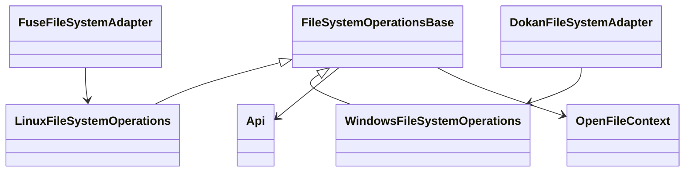

# Taking the Linux features to Windows

> **Route**: [docs/README.md](../README.md) › **this document**
>
> **What this document is the source of truth for**: **the design and the as-built** of the Windows (Dokan)
> implementation, and the order in which the Linux features are taken to Windows. The Windows-specific
> behaviour that measurement turned up belongs here too.
>
> **The neighbouring documents and what they cover**:
>
> | Document | What goes there |
> |---|---|
> | [../Assign.md](../Assign.md) | **The user-facing specification** (the CLI, the prerequisites, the known limitations) |
> | [handle-context.md](handle-context.md) | Unifying the handle context (stages A to D). Where the common-classes-and-responsibilities section is headed |
> | [permission-interop.md](permission-interop.md) | The interoperability of the ACLs and the permissions between Linux and Windows |
> | [../tests.md](../tests.md) | The counts of the Windows suites and how to run them |

This document is the design and the as-built of the Windows side.
**Of this document, the "the Windows basics" stage was implemented and verified on real hardware** (the implementation-status section below). **Everything else proposed here (extracting the common
classes, deriving the owner, the native extensions and the rest) is unimplemented**, and the performance has
not been measured. For the current specification see [Assign.md](../Assign.md).

## Implementation status (as-built)

Of the **Windows basics** stage of the "the order of implementation" table in this document,
**what needed no specification judgement is implemented** (`src/dokan` / `src/assign` / `tests/windows` only;
Core is unchanged).
The verification was on real Windows hardware (Dokan 2.3.1, with PG in the `pgfs` schema on the server,
Citus rf=2, audit on), with **the e2e, cross-client and write-back (`mount.write_back` on) suites all green
three times in a row**.

> **The counts are not written here. [tests.md](../tests.md) is the source of truth.** At the time
> it was e2e 30 / cross-client 6 / write-back 6, but **the suites and the counts have grown since**
> (at one point it was e2e 38 / cross-client 10).
> **Leaving the numbers here gets read as "the Windows tests are 30 cases".**

| # | What went in | Where | The verification |
|---|---|---|---|
| 1 | **Making CREATE_NEW exclusive** - `FileMode.CreateNew` now reaches `Api.CreateFile(..., exclusive: true)`. The collision decision moved from a local non-existence check to **the database's unique constraint** | `FileSystem.CreateFile` / `DoCreate` | `test_createnew_exclusive` (the second one fails and the loser does not damage the winner's contents) plus **exactly one success in all 6 cross-client rounds** ([crossclient.ps1](../../tests/windows/crossclient.ps1)) |
| 2 | **Separating the allocation from the EOF** - `SetAllocationSize` truncates only when shrinking, and growing is a no-op success that does not change the EOF | `FileSystem.SetAllocationSize` | `test_allocation_size_does_not_extend_eof` (a `FileStreamOptions.PreallocationSize` of 1 MiB leaves the EOF at 4 bytes) |
| 3 | **Making the notification path absolute** - the real mount point that `Mounted` reports is kept, and `P:\dir\file` is passed to `NotifyUpdate` (it used to be `\dir\file` with no mount point). The bool return value is used in the failure log too | `FileSystem.Mounted` / `ToNotifyPath` / `NotifyUpdate` | It was aligned with the contract of the driver API ("an absolute path including the mount point"). **The visibility across two mounts was measured** (a create, an overwrite, a delete and a replacing rename all follow within a few hundred ms). The event kinds in Explorer were not verified |
| 4 | **Closing the fail-open of flush** - `FlushFileBuffers` no longer returns Success when it cannot resolve what to sync (FileNotFound plus an Error log) | `FileSystem.FlushFileBuffers` | The same treatment as Linux's Phase 0 (2). It fired 0 times during the e2e suite |
| 5 | **Checking the return value of truncate** - a failure of `TruncateData` is no longer turned into a success for `FileMode.Create` / `FileMode.Truncate` | `FileSystem.CreateFile` | No regression in the existing e2e suite |
| 6 | **A guard for a rename onto the same target** - a `MoveFile` onto the same path or the same inode is a no-op success and does not enter the replacement deletion | `FileSystem.MoveFile` | `test_rename_same_path_noop`. The breakwater on the Core side (the same-id check in `Api.Rename`) was implemented on the Linux side |
| 7 | **Observing the directory semantics** - a request for a directory does not open an ordinary file (`NotADirectory`) | `FileSystem.CreateFile` (Open / OpenOrCreate) | Measurement shows Windows probes by "trying to open it as a directory first". Returning `NotADirectory` makes the caller reopen it as a file |
| 8 | **Reporting a loss in the exit code** - `assign.pgfs` disposes the `FileSystem` -> `api.Dispose()` -> **exit 4** when `UnflushedAtShutdown > 0` (the same contract as mount.pgfs). A double stop from Ctrl+C and `Unmounted` is prevented too (**where the stop signal is subscribed moved to the Program side in #19**) | `Assign/Program.RunDokanMountAsync` / `FileSystem.RequestStop` | That a clean unmount exits 0 and the contents survive is confirmed by [writeback.ps1](../../tests/windows/writeback.ps1)'s `test_wb_graceful_unmount_persists`. **exit 4 actually firing** was confirmed in the abort experiment of #19 (1057 unflushed entries -> exit 4) |
| 9 | **Fixing where the audit subject is obtained** - the caller is settled in `CreateFile` and put on the handle (`OpenFile`), and the later mutating operations use that | `FileSystem.CaptureRequestor` / `ApplyAuditContext` / `OpenFile` | See below |
| 10 | **Wiring WRITE_THROUGH** - a handle with `FileOptions.WriteThrough` is carried on `OpenFile` and **a complete barrier (`Api.FlushInode`) is raised on every WriteFile** | `FileSystem.CreateFile` / `.WriteFile` / `OpenFile.WriteThrough` | [writeback.ps1](../../tests/windows/writeback.ps1)'s `test_wb_writethrough_survives_kill` (killed without a flush or a close -> the contents survive. **With a negative control** = a write with no barrier is lost) |
| 11 | **Checking the mount point in advance** - a drive letter in use, a directory that does not exist and a directory that is not empty are rejected before startup, and free candidates are offered | `Assign.Program.DescribeUnusableMountPoint` | Confirmed by hand (a `Q:` CD-ROM with no media gives "it is already in use" plus the list of free letters; a directory that does not exist gives "there is no such directory") |
| 13 | **Making an attribute change idempotent** - `SetFileAttributes` returns success without touching the database when there is no substantive change | `FileSystem.SetFileAttributes` / `.IsAttributeChangeNoop` | `Remove-Item` calls `SetFileAttributes` to drop ReadOnly before deleting, which **made it impossible to remove a pending inode whose flush was permanently failing** (= the one means of recovery was unusable from Windows). A dotfile is not made a no-op because the heuristic suppression has to be saved (the regression is `test_dotfile_unhide_sticks`) |
| 14 | **Turning an exception into an NTSTATUS** - Core's exceptions are caught in `CreateFile` and `SetFileAttributes` | `FileSystem.CreateFile` (split out into `CreateFileCore`) | DokanNet used to round them into a generic error and the log said only `Throw` (observed on a create during the write-back error state) |
| 18 | **Refusing a destructive operation to the caller during the error state** - `Api.CanDestroy` is consulted in the 5 places `DeleteFile` / `DeleteDirectory` / `SetEndOfFile` / `SetAllocationSize` (shrinking) / `MoveFile` (replacing) and `DokanResult.Error` is returned | `FileSystem.BlocksDestroy` and the rest | `test_meta_error_state_blocks_persisted_delete` (`blocked=True` and the file survives). **`Cleanup` is void, so letting it get that far makes it "a success although nothing was removed"** |
| 17 | **Leaving the byte-range locks to the driver** - `DokanOptions.UserModeLock` was removed and `LockFile` / `UnlockFile` return `NotImplemented` | `FileSystem.Run` / `.LockFile` / `.UnlockFile` | `test_byte_range_lock_enforced` (the `Lock` of a second handle gives an `IOException`, and it can be taken after the `Unlock`). **It used to always return Success = lying that a lock that was never taken had been taken.** Across separate mounts it is not supported |
| 16 | **Deriving the owner (proposal B)** - the `uname` of a new inode is the **requesting User SID** normalized through `UnameOf`, and the `gname` is **inherited from the parent directory**. If they cannot be obtained, it is `fallback_uname` / `gname` plus a Warning, and **it never masquerades as the running process's user** | `FileSystem.CaptureCaller` / `DoCreate` / `WindowsUserResolver.FallbackUname` | `test_new_file_owner_is_requestor` and `test_new_file_inherits_parent_group` were added to the e2e suite (27 -> 30 -> **32 cases**). `.User` is used rather than `.Owner` (with an elevated process the latter turns into Administrators) |
| 15 | **A `NotifyDelete` for a local delete too** - what this mount deleted is notified to Windows as well | `FileSystem.Cleanup` / `.NotifyLocalDelete` | The cache remnant after a delete while another process held a handle went from **2 out of 3 runs to 1** (it does not go away completely; see the measurements below) |
| 12 | **Notifying a remote delete** - something that is gone is not invalidated by `NotifyUpdate`, so it is re-fetched and, if it is gone, a **`NotifyDelete`** is fired | `FileSystem.PropagateRemoteChange` / `.NotifyDeleted` | The cross-client `test_x_delete_visible_from_peer` is **green three times in a row** (before this fix it FAILed once in three) |
| 19 | **Staging the stop signal (the Windows wiring of B-12)** - the subscription to `Console.CancelKeyPress` was **lifted out of `FileSystem.Run()` into `assign.pgfs`**, with the 1st press = a request to unmount, the 2nd = **`Api.AbandonFlush()`** and the 3rd and later = the default immediate exit. Previously the subscription came off the moment the 1st press left `Run()`, leaving **the middle of the shutdown flush unguarded** (the 2nd press = instant death with neither a loss report nor a gravestone) | `Assign.Program.RunDokanMountAsync` / `FileSystem.RequestStop` | By hand (1200 pending entries, a 600-second deadline -> from the 2nd Ctrl+Break it aborted in **152 ms**, with the loss report plus `exit 4` plus the gravestone `unflushedLoss: 1057`). No automated test was written (the same judgement as Linux's B-12). **A `CTRL_C_EVENT` through `AttachConsole` does not reach the target; a `CTRL_BREAK_EVENT` does.** For the details see [metadata-write-back-reviews.md, the Windows wiring of B-12](metadata-write-back-reviews.md) |

### The visibility of a delete - the re-measurement on 2026-09-20 showed it is not a cross-client problem

`crossclient.ps1`'s `test_x_delete_visible_from_peer` started failing, and following it through the mount log
showed that **the notification path was healthy and what was stuck was A's own local delete**.

```
00:29:23.823  A's write notification -> visible from B (Wait-Visible OK)
   … 15.0 seconds: B enumerates every 320 ms and gets x_del.txt every time (consuming Wait-Gone's budget) …
00:29:39.343  SetFileAttributesProxy : \xtest\x_del.txt   <- Remove-Item dropping ReadOnly
00:29:39.345  DeleteFileProxy         Return : Success    <- this is when the delete reached the FS
00:29:40.290  NotifyDelete(file): R:\xtest\x_del.txt      <- the notification is 0.95 seconds after the delete = fast
```

**`Remove-Item` returns at once, but Windows only holds the `DeleteFile` pending (`DeletePending`)** and
**does not call the FS callback until the last handle closes**. Who holds a handle is up to Explorer, the
indexer and Defender, and measurement showed it could open a window of **over 15 seconds** (the log shows an
open of `\autorun.inf` = the shell licking at it because of the `RemovableDrive` setting).
The test was watching B during that time, so it **counted "something that is not even gone on A yet" being
visible from B as a failure of cross-client visibility**.

**The test was fixed**: `Remove-Item` was dropped in favour of **opening with
`FileOptions.DeleteOnClose` and closing** (the delete is settled by the close of a handle we hold), plus
**confirming it is gone on A first** and only then waiting on B. It went **green five times in a row**. Before
the fix it failed 3 out of 5 consecutive runs.

> **The lesson about measuring**: do not judge a regression by the failure rate alone. The baseline
> It failed 1 in 5 too, and the difference in the rates (20% against 75%) moves with
> **external load such as a Defender scan right after a publish**. Until the mechanism was seen in the log, it
> could be read as "my change made it worse".

**`test_touch_unlink` (the single-mount e2e suite) was the same mechanism** (confirmed 2026-09-20).
`Assert-Absent` already **polls the parent directory's enumeration for 10 seconds** and was still failing =
which means there are cases where **Windows takes more than 10 seconds to issue the `DeleteFile`**. It was made
`DeleteOnClose` in the same way and went **green five times in a row**. That reduces the "known flake that fails
one run in three" to **one single cause behind both**, and resolves it.

> **The conclusion**: "the remaining work on the visibility of a delete" **was a problem with how it was tested,
> not with the FS**. pgfs deletes the moment it receives the `DeleteFile` callback and notifies (measured at
> 0.95 seconds to land on the other mount); what is slow is **Windows getting round to calling that callback**.
> There is no need to look for anything other than `NotifyDelete` on the FS side. **The window in which an
> application sees "it is still there although I deleted it" remains**, but that is the same Windows semantics
> as on NTFS and is not specific to pgfs.

**One real bug was fixed along the way**: only the `Debug(string, params object[])` of
`src/dokan/src/Logger.cs` was missing the `[message, ..args]` spread, so `Logger.Log(Level.Debug, message,
args)` was passing `[message, args]` into `Log(Level.Enum, params object?[])`. As a result
**every multi-argument `Logger.Debug` in the Dokan layer printed nothing but `System.Object[]`** (`Info` /
`Warn` / `Error` / `Fatal` spread correctly, so only Debug was missed). Without fixing it, the analysis above
would not have been possible.

### Facts that measurement turned up during the implementation

- **`GetRequestor` succeeds only inside CreateFile.** It used to be called at the head of `Cleanup` /
  `MoveFile` / `SetFileAttributes` / `SetFileSecurity`, where it failed with
  `Invalid token for impersonation - it cannot be duplicated`, and **every Windows audit row had a null caller**
  (**3400 failures** in one pass of the e2e suite). After the fix there were 0 failures over the same interval,
  and `{prefix}audit` was confirmed in the database to carry `caller_uname=<the logged-in user>` /
  `caller_domain=<the workstation name>` (for create/delete/chmod/rename/chown).
  -> Points 1 and 5 of the create, owner and audit section of this document are backed by real hardware.
  **Deriving the owner (uname/gname) is still the process default**, which is a separate stage.
- **There is a window in the visibility of a delete.** Right after `Remove-Item` returns, `Test-Path` still
  returns true, and it takes a measured **about 0.6 seconds** for the absence to be visible (the substance of
  the delete is triggered by `Cleanup` plus a Citus DELETE of about 100 ms plus the Windows-side cache).
  That is within Dokan's delete-on-close semantics, but **a test must not decide on a single `Test-Path`**
  (`Assert-Absent` in `tests/windows/e2e.ps1` was changed to a bounded retry plus a double check through the
  enumeration).
- `OpenFile` is **the Windows-side advance implementation** of the `OpenFileContext` of the
  common-classes-and-responsibilities section of this document. Today it holds only the resolved inode plus the
  audit subject, and not yet the stable identifier, the access mode or the sync policy. When they are unified,
  this class settles on the derived side.

### The cross-client measurements (2026-09-19, [crossclient.ps1](../../tests/windows/crossclient.ps1), 6 cases)

The same DB-FS was mounted by two `assign.pgfs` instances (P: and R:) and measured. **6/6 PASS three times in a
row** (after the delete notification was fixed to use `NotifyDelete`; before that, the one delete case failed
once in three).

- **The exclusion is decided in the database**: all 6 rounds of a simultaneous `CREATE_NEW` had exactly one
  success, and the winner's contents were intact. -> The proof that point 1 above (exclusive: true) works across
  clients too. A simultaneous `mkdir` also produces exactly one body.
- **The visibility depends entirely on `database.notify_enabled`.** With the default (false), another mount's
  create, overwrite, delete and replacing rename **are never visible** (all 4 stay stale; the `InodeCache` and
  the read cache are per mount and an invalidation arrives only through LISTEN/NOTIFY). With `--notify` on both
  mounts, all 4 followed within a few hundred ms. -> **Running several mounts on Windows makes notify
  effectively mandatory.** This fact was written into [Assign.md](../Assign.md) and
  [tests/windows/README.md](../../tests/windows/README.md) as well.
- Incidentally: specifying an existing other drive (`Q:` in this environment) makes Dokan fail with the generic
  exception `Something's wrong with the Dokan driver`. -> **A pre-check was added to assign** (point 11 above).
  The pitfall is that `Directory.Exists` **cannot** make the decision: a CD-ROM with no media or an unconnected
  removable drive has "no root but the letter is taken", so `DriveInfo.GetDrives()` has to be consulted.
- The visibility of a delete cannot be had with `NotifyUpdate` alone: something that is gone is treated as an
  attribute change and the entry stays in the peer's Windows cache. It was resolved by **re-fetching and firing
  a `NotifyDelete` if it is gone** (point 12 above). The kind (file or directory) cannot be known once it is
  gone, so it tries file and then directory (putting the op and the kind on Core's notification payload is the
  proper fix; it is a candidate in the notification section).

### The measurements of metadata write-back and the B-1 knob (2026-09-19, [wbmeta.ps1](../../tests/windows/wbmeta.ps1), 4 cases)

Measured with **two real mounts**, A = `defer` plus write-back and B = write-through (the Linux side uses fault
injection through psql). **3 passed / 1 failed.**

- ✅ **The requirement of B-1 is met**: B occupies a name A created and left pending -> **A's explicit barrier
  fails and the occupier B's contents are intact**. The log likewise shows the flush failing repeatedly with
  "the name of the inode created with O_EXCL ... is occupied by the existing inode ...", confirming that
  **the occupier is not removed**.
- ✅ **The close-no-flush contract**: a file A created and merely closed is lost on a kill (the file does not
  survive at all).
- ✅ **The `CreateNew` exclusion within one mount is kept even under defer.**
- ❌ **Recovery through an `unlink` does not work (unfixed on the Core side)**: deleting on the loser's side
  removes the pending entry (and the unmount goes back to exit 0), but **the error-state latch does not clear**
  and later creates stay `-EIO` (`write-back: new writes and creates are refused because the flushes are failing
  consecutively`). It was reported to the Linux side. The Windows test is left FAILing as the contract says.
- **exit 4 does reach the caller on Windows**: `assign.pgfs` is a foreground process, and an unmount that left a
  loss was confirmed to return **exit 4** (Linux's `mount.pgfs` daemonizes and the parent exits 0 first, so it
  does not reach - it was moved to the gravestone in the database in B-2).

### How the owner and the group are decided (decided)

| The item | The decision | The reason |
|---|---|---|
| `uname` | **The requesting User SID** (`WindowsIdentity.User`) normalized by `WindowsUserResolver.UnameOf` (`DOMAIN\Alice` -> `alice`) | The stored form follows the "names only; no SID or UID is held" convention of [permission-interop.md](permission-interop.md). `.Owner` is not used because it can be `Administrators` with an elevated process |
| `gname` | **Inherited from the parent directory** (proposal B) | A Windows token's primary group is effectively `Domain Users` or `None` and is not used in the permission decision either. With inheritance, "the same tree is the same group" and the group bits of the mode mean something. **It differs deliberately from the Linux default (the creator's primary group)** |
| On a failure to obtain them | `fallback_uname` / `fallback_gname` (`nobody`/`nogroup` by default) plus a Warning | pgfs does not enforce access or share today, so the owner only affects the display and the audit. Failing the create would do more real harm. **It switches to "fail" in the stage that introduces enforcement** |
| A knob | **Not created** | `mount.owner_from_requestor` was considered, but adding a Field is `src/core/src/Config/Schema.cs` = the Linux side's territory. Only the behaviour equivalent to on-by-default was implemented, and if an escape hatch is needed, a Field can be added on the Core side |

**The pitfall**: the normalization drops the domain, so **`CORP\alice` and `LOCAL\alice` become the same
`alice`**. That was already the case for the read projection, but **this is the first time the domain is
flattened on the write side (deciding the owner)**. Name resolution in a domain environment (its latency and
failure rate) is unverified and is a subject for a PoC.

### The reachability PoC for native links (hardlink / junction / symlink) - **they cannot be created, and reading them is broken too**

**On the API side**: **not one link callback exists** among the 25 members of `IDokanOperations2`. On the
reparse side, `FileSystemFeatures.SupportsReparsePoints` / `NtStatus.Reparse` /
`WIN32_FIND_DATA.dwReserved0` (the reparse tag) exist as types, but **there is no entry point for getting or
setting the reparse data**.

**Creation, measured** (run on P:; all four fail, and for different reasons):

| The operation | The result |
|---|---|
| `mklink /H` (a hardlink) | `The parameter is incorrect` (the request never reaches the FS) |
| `mklink /J` (a junction) | `Local NTFS volumes are required to complete the operation` |
| `mklink /D` (a symlink) | `The device does not support symbolic links` |
| `File.CreateSymbolicLink` (.NET) | `ERROR_INVALID_FUNCTION` |

**Reading, measured** (a symlink row of the shape Linux creates = `S_IFLNK` in `st_mode` plus a `link_target`,
made as a single row with psql and deleted afterwards):

| How it is looked at | The result |
|---|---|
| A directory enumeration (`GetFileSystemEntries`) | **It does not appear** (invisible from Explorer and `dir`) |
| Getting the attributes with the path given directly | `ReparsePoint` / `Length = 10` / `Exists = True` (**visible**) |
| Reading the contents (`ReadAllText`) | **An empty string comes back** (not the target's contents, and it is not an error either) |
| `Get-Item`'s `LinkType` / `LinkTarget` | **Both empty** (Windows does not treat it as a link) |

-> Not appearing in the enumeration seems to be because **there is no slot to return the reparse tag in**
(`FindFileInformation` has nothing equivalent to `dwReserved0`), so it is dropped as "a reparse point with no
tag".
**It is worse than this document's "there is no guarantee it can be opened as an ordinary link": in reality it
disappears from the enumeration and opens as an empty file when named directly.**

**The conclusion**: with the current binding, **neither creating nor reading works**. Since it is now settled
that "there is no entry point on the Dokan side", the junction item in [next.md](../next.md) presupposes
**an addition to DokanNet / Dokany or a switch to WinFsp**.

### The reachability PoC for the `du` equivalent (AllocationSize) - **there is no path to return it**

**The conclusion: with DokanNet 2.3.0.3 the FS cannot declare an allocation size.** What comes back is a value
the driver synthesizes from the EOF.

- **On the API side**: `AllocationSize` exists **only on `SetAllocationSize` (an input)**. The output structs
  `ByHandleFileInformation` and `FindFileInformation` **have no slot for it at all** (only `Length` = the EOF).
- **Measured** (reading what Windows declares directly with
  `GetFileInformationByHandleEx(FileStandardInfo)`):

| The subject | pgfs's real occupancy (`pgfs_data.total_size`) | `st_size` (the EOF) | The AllocationSize Windows returns |
|---|---|---|---|
| A file with a single byte written 8 MiB in | **1 byte** | 8,388,609 | **8,389,120** (the EOF rounded to a 512 boundary) |
| A file with 4 KiB written densely | 4,096 | 4,096 | 4,096 |
| An empty file | 0 | 0 | 0 |

-> **For a sparse file it declares 8 million times the real occupancy.** pgfs itself holds the correct value
(1 byte), and on Linux it comes out in `du` through `st_blocks`
([database.md, the occupied bytes and st_blocks](database.md)). **The only difference is that there is no path
on the Windows side.**

**The options**: (1) a PoC of whether an output slot can be added to DokanNet / Dokany (the driver may need
changing); (2) WinFsp has `AllocationSize` on `GetFileInfo`, so swapping the backend would solve it;
(3) **keep stating it as unmet**. It is (3) for now. Showing the `du` equivalent on Windows is
**impossible without touching the driver or the binding**.

### The measurements of the visibility of a delete (2026-09-19)

**pgfs has deleted it, yet the client sometimes does not see it gone.**

- Measured on its own, both `Remove-Item` and `File.Delete` make it absent in **100 to 160 ms**.
- Deleting it with another handle open leaves **the name in the enumeration but the open fails**
  (delete-pending) -> it goes away when the handle is closed = correct behaviour.
- During an e2e run, though, even after the database says `DELETE inode ... rows:1`, it stays
  **in the enumeration and openable for over 10 seconds** in **one run out of three**. There is not one query to
  the FS in the log during that time = **the Windows-side FCB cache is answering** (a concurrent open by the AV
  or the indexer seems to be keeping the FCB alive). Firing a `NotifyDelete` for a local delete too lowered the
  frequency but did not resolve it.
- -> `test_touch_unlink` in `tests/windows/e2e.ps1` is **a known intermittent FAIL** (for the above reason).
  **pgfs's own delete is confirmed in the database.**

### The Windows acceptance of B-7 (a destructive operation during the error state) - ✅ resolved

**Core stops it correctly.** Measured (2026-09-19, `wbmeta.ps1`'s
`test_meta_error_state_blocks_persisted_delete`): deleting **a persisted file from A during the error state
leaves the file visible from both mounts** (and readable).

At first **the failure did not reach the caller** (`Remove-Item` returned successfully). **Dokan's `Cleanup` is
void**, so the exception from `Api.DeleteInode` was swallowed there, making it **"it looks like a success
although nothing was removed" = the same shape as the fail-open that Phase 0 (2) closed**.

-> **`Api.CanDestroy(inode, out reason)` (a side-effect-free predicate) was added to Core**, and it is consulted
in the **5 places** `DeleteFile` / `DeleteDirectory` / `SetEndOfFile` / `SetAllocationSize` (shrinking) /
`MoveFile` (replacing) to return `DokanResult.Error`. Measurement confirmed `blocked=True` with the file
surviving.

> **⚠ Do not make the decision on the adapter side by looking only at `WriteBackErrorState`.** Whether it is
> pending or persisted is Core's internal state, and ignoring it **stops even the deletion of a pending entry
> and blocks B-1's means of recovery (unlinking on the loser's side)**.
> It is the same shape as what was once hit in `SetFileAttributes`. The decision must always be
> left to `Api.CanDestroy`.

### What this stage **did not** do (still unmet)

The exclusion of `mkdir` (Core has no entry point for `exclusive`) / **acceptance with metadata write-back
on** / handle-based identification (paths take priority today) / revisiting `UserModeLock` / native links and
xattr / a Windows Service. The relevant section of this document is the source of truth for each.

### `mkdir` is not made synchronous (ruled on; rewritten from "unfixed")

**`Api.CreateDirectory` stays `exclusive: false`.** It was written up for a long time as "Core has no entry
point = unfixed", but **this is a ruled-on specification**, not a defect to be fixed.

**The reason for the ruling** ([metadata-write-back-reviews.md](metadata-write-back-reviews.md) / the stage 2
as-built, difference 5): **making it synchronous means a pending directory can never come into existence in
principle, which makes the ancestor-chain INSERT and the adoption of an existing id for dir/dir (the Rekey) into
unreachable code.** `wbmeta.sh`'s `test_meta_exclusive_create_is_write_through` **asserts that "mkdir has no row
in the database either" and says explicitly that "this is where a change would be noticed"** = **the ruling is
pinned by a test**.

**What is actually guaranteed**:

| The mode | A collision of two `mkdir`s with the same name |
|---|---|
| **The default (`write_back_metadata` = off)** | **The database's unique constraint `(parent_id, name)` rejects it.** Even across clients **there is always exactly one body** (`test_x_mkdir_race` in [crossclient.ps1](../../tests/windows/crossclient.ps1); the Linux side likewise) |
| **`write_back_metadata` = on** | **There is still room for both to turn into successes through the pending adoption** (the collision is resolved at flush time). **An `O_EXCL` create can be forced to write-through with [the B-1 knob](metadata-write-back.md) (`write_back_metadata_exclusive_create`), but `mkdir` is not covered by that knob.** |

**In other words, using `mkdir` as a locking primitive does not hold once `write_back_metadata` is on.**
Use an `O_EXCL` create (which is write-through by default).

### `ReadOnly` touches only the write bits

**`SetFileAttributes` was rebuilding the `st_mode` as 0444 / 0644 / 0755 on a change to `ReadOnly`.**
The real harm is that **putting it on a directory made it 0444 at once, dropping the x bit so that Linux could
not `cd` into it**, and **the Windows side cannot notice because it does not hold a mode** (the breakage is only
visible from Linux).

| | What it does |
|---|---|
| Setting it | **Drops every write bit (0222).** `FileSystemUtils.IsWritable` judges it writable **if owner, group or other has +w**, so dropping only the owner's does not make it look ReadOnly from Windows |
| Clearing it | **Restores only the owner's write (0200)** |

**Measured (2026-09-21, on the server)**: a directory at `0755` -> ReadOnly -> **`0555`** (the x survives) ->
cleared -> **`0755`** (a complete round trip). Before the fix it was `0755` -> **`0444`** -> `0755`, and
**it could not be traversed while it was RO**.

**The remaining trade-off**: **a mode that had write on the group or other loses those two across the round
trip**, because there is nowhere on the POSIX side to remember "the original write bits" (remembering them would
mean adding it to the win-attrs xattr).
**It does not happen for the modes Windows creates (0644 / 0755)**, so it is accepted for now.

**The regression**: `test_readonly_dir_keeps_execute` in [e2e.ps1](../../tests/windows/e2e.ps1) (37 ->
**38 cases**). It looks at **whether the execute permission survives in the projected ACL** (the mode is not
visible from Windows).
**Confirmed to fail against the old implementation.**

#### The cross-OS measurement (2026-09-21, set on Windows and checked from Linux)

**A directory with ReadOnly set on Windows (in the server's `pgfs`) was checked by mounting the same database
from the Linux client.** **"It cannot be `cd`'d into" is about mounting with `-o default_permissions`**
(by default neither pgfs nor the kernel enforces the mode, so a broken mode passes straight through):

| The mount | `st_mode` | `cd` |
|---|---|---|
| The default (**without** `default_permissions`) | 0444 (the pre-fix value) | **It works** - the mode is not enforced |
| **`-o default_permissions`** | **0444 (the pre-fix value)** | **`Permission denied`** <- the real harm |
| **`-o default_permissions`** | **0555 (after the fix)** | **It works** (reading inside is fine too) |

**In other words, on a default mount "a broken mode quietly remains", and the moment `-o
default_permissions` is added it cannot be traversed.** It also rides straight into the **tools that preserve
and reproduce a mode** (`tar`, `rsync -p`, a backup). **It was the kind of defect where no symptom shows
immediately but the record is broken.**

> **This section at first said "it cannot be `cd`'d into from Linux" with no condition, and it was corrected
> once measurement showed it did not reproduce on the default configuration.** **`default_permissions` is
> opt-in** (see "the access decision is delegated to the kernel through the `default_permissions` given at mount
> time" in [fuse/src/FileSystem.cs](../../src/fuse/src/FileSystem.cs)), and the mode has no effect unless it is
> given.

### Windows's `FileIndex` was made to come from `data_id` (2026-09-21, measured)

**`inode.Id` was being put in `ByHandleFileInformation.FileIndex`, so hardlink siblings were judged to be
"different files".** It was aligned with **the same formula** as FUSE's `st_ino`.

**Measured** (a native hardlink cannot be created from Windows, so **a second name pointing at the same
`data_id` was created with psql** to check; the same trick as `negcache`):

| | a.txt | b.txt (the same body) |
|---|---|---|
| **Before (`inode.Id`)** | 28639 | **28640** <- different although `nlink = 2` |
| **After (from `data_id`)** | 9223372036854817145 | **9223372036854817145** (they agree) |

- **The formula is `data_id | 0x8000_0000_0000_0000`** - the same as
  [FUSE's `FillStat`](../../src/fuse/src/FileSystem.cs). **The same file returns the same value on both
  operating systems.**
- **The top bit is a namespace tag.** `inode.id` and `data_id` are **separate sequences** and both start at 1,
  so with the raw numbers "the file with data_id 5" and "the directory with inode 5" would collide.
  **This value is not stored in the database** (it is computed when it is returned).
- **`FileIndex` is a `long` (signed), so it is negative in C#**, but **Windows passes it through as an opaque
  64-bit value** (confirmed by measurement). POSIX's `st_ino` is a `ulong`, so the same bit pattern looks like a
  huge positive number.
- **It is immutable from birth.** `data_id` is **settled at create time** (`Api.CreateFile` takes the
  allocation in advance) and **a `truncate -s 0` does not remove the `{prefix}data` row**, so
  **the value does not change across the first write** (measured: an empty file at 9223372036854817081 stays the
  same after a write). For the details see [data-id-lifecycle.md](data-id-lifecycle.md).
- **Anything with no body (a directory or a symlink) stays on `inode.Id`.**

**The test**: `test_file_index_is_data_id_and_stable` in [e2e.ps1](../../tests/windows/e2e.ps1) (35 ->
**36 cases**). Three points: (1) the top bit is set (= the data_id space); (2) **it does not change across the
first write**; (3) a directory is in the inode space. **Confirmed to fail against a build that returns
`inode.Id`** (`the FileIndex does not come from data_id (the top bit is not set): 29112`).
**That the siblings agree is held by the Linux side's `st_ino` test** (a hardlink cannot be created from
Windows).

## The recommended policy

**Keep the existing DokanNet 2.3.0.3 and align the contract between the common Core and the OS adapters.**
The data write-back, the metadata write-back, the negative cache, the live settings and the status already exist
in Core. Rather than rebuilding the same caches and SQL for Windows, the missing wiring for the exclusive
create, the handles, the flush, the shutdown, the owner and the notifications is put in order.

The common behaviour goes in the parent class and the OS-specific behaviour in the derived classes. But the
existing FUSE callbacks inherit from `FuseFileSystemBase`, so **the recommended structure is to put a parent
class that carries the common operation handling, plus its per-OS derived classes, on top of the Core API and
have the existing callbacks use it.** No multiple inheritance between the callback types.

Reproducing Linux's known data losses on Windows is not feature parity. Fixing the common problems and
confirming the Linux regression is the gate that comes first.
Both write-back settings stay off by default, and metadata on is not called supported on Windows until after an
acceptance test that includes the failure cases.

## The feature map (the current state as statically confirmed)

| The feature | Linux / the common Core | The current Windows code | How it is treated when taken across |
|---|---|---|---|
| bytea I/O, truncate, the Citus exclusion and retry | Shared in Api | It calls the same Api | Reuse the common fixes and re-verify an ordinary copy and concurrent I/O on Windows |
| The inode LRU and the content read cache | InodeCache / ContentCache implemented | Enabled when the Api is built | No separate Windows implementation is needed. Test read cache=0 and eviction with a small budget too |
| The negative cache | `negative_cache_ttl_ms`, 0 by default, Live | It uses the same GetByPath | Confirm the case sensitivity, the enumeration and the visibility of a remote create |
| The data write-back | Dirty chunks, the background flush, the explicit sync | WriteFile -> WriteData, FlushFileBuffers -> FlushInode, Cleanup -> CloseInode, **WriteThrough is a complete barrier on every WriteFile** | The explicit sync and WriteThrough are verified by [writeback.ps1](../../tests/windows/writeback.ps1) 6/6. **I/O after Cleanup (paging / mmap) is not in place** |
| The metadata write-back | pending-born, fsyncdir, the replacing rename | CloseInode / FlushDirectory / PrepareRenameReplace are connected. The CreateNew exclusion was fixed | **Acceptance with it on is complete** - [wbmeta.ps1](../../tests/windows/wbmeta.ps1) passes with two real mounts (re-run 2026-09-21: 4 passed + 1 skip). **The skip is observing the recovery through an `unlink`**, which **cannot be observed in this environment** because Windows defers the `DeleteFile` (the contract itself is verified on the Linux side) |
| The exclusive create | FUSE O_EXCL -> `exclusive:true` | ~~Api.CreateFile's default of false even for CreateNew~~ -> **fixed** | `exclusive:true` is passed and the synchronous cross-client exclusion is kept (measured with two mounts: always exactly one success). **mkdir stays deliberately asynchronous** (the section on not making `mkdir` synchronous) |
| The atomic replacing rename | The same tx in Api.Rename | MoveFile uses the same overload | Verify the same-target decision, the exceptions, the existing handles and the dirty state of the source and the target |
| UTC times | Stored in the database as a UTC wall clock | ToLocal / ToUniversalTime are there | Remount with UTC and non-UTC, and round-trip between the two operating systems. Make the current contract explicit that the atime and creationTime are not updated |
| The caller as owner | The uid/gid of fuse_get_context | DoCreate uses the mount process's DefaultUname/Gname | Derive the owner and the group from the requesting token |
| The audit | Core's capture at operation time and the INSERT inside the tx | ~~GetRequestor re-fetched on every operation (failing every time)~~ -> **fixed**: settled in CreateFile and held on `OpenFile` | Remaining: propagating it into the background flush (to be confirmed when write-back on is accepted) |
| The settings, the status and the GUI | ConfigAdmin / StatusAdmin, the LISTEN, the heartbeat | assign starts the same Api | No CLI needs reimplementing. The GUI is a read-only MVP, and the write screens are a common unimplemented item |
| df / the free space | GetStatFs, a 5-second cache | GetDiskFreeSpace uses it | Verify require/auto/nominal and Citus rf>=2 on real hardware |
| The payload occupancy behind the `du` equivalent | GetOccupiedBytes -> st_blocks | ByHandleFileInformation has only Length | **A PoC was done = there is no path to return it** (the output struct has no slot and the driver synthesizes it from the EOF). See the AllocationSize reachability PoC above |
| The ACLs and the Windows attributes | The canonical POSIX store | The SD projection, user.win.attrs | Strictly enforcing a named ACL is incomplete on both sides. Keep the display and the access refusal as separate tests |
| symlink / hardlink / arbitrary xattr | There is an entry point in FUSE (with a known problem for hardlinks) | There is no entry point for the native creation APIs. ADS is not supported either | It needs the extension investigation below. Do not treat the mere existence of a Core API as done |
| The notification of a remote change | Core's cache invalidation; no OS notification on Linux | ~~A path with no mount point~~ -> **fixed** (the real mount point is prefixed and the return value is logged) | The visibility was measured with two mounts. **Not one FileSystemWatcher event comes from another mount's changes** (measured 2026-09-21; a local operation does produce `Created` / `Changed` / `Renamed` / `Deleted`) = **`NotifyUpdate` invalidates the cache but does not produce a `ReadDirectoryChangesW` notification**. **A window that is already open does not refresh.** Full page-cache consistency is unverified |
| A clean stop and the loss report | SIGINT / SIGTERM, exit 4 if anything is left at exit | ~~There is a Dispose but the return value stays 0~~ -> **fixed** (exit 4 plus preventing a double stop) | **Confirmed to fire for real** - with the metadata write-back at `defer`, A holds a pending create and **B occupies the same name with `CreateNew`**, and A's flush then fails forever. Stopping **cleanly** with `dokanctl /u` in that state gives `UnflushedAtShutdown > 0` and **exit 4 reaches the caller**. **Stopping with nothing unflushed exits 0**, so the contract is confirmed. **`--write-back-interval-ms 0` is mandatory** (with the default of 1000 ms, the background flush materializes the pending entry before B arrives and no collision happens). Unifying the shutdown handling is not done |
| Mounting at startup | The fstab helper / a daemon | An interactive Run / Ctrl+C | Interactive startup at first; a Windows Service is added as a separate stage for continuous operation |
| The OS-specific options | max_write, the FUSE `-o`, foreground | The FUSE settings are not actually applied | Distinguish which OS each option targets in the Windows help and the startup diagnostics, and do not port an identically named option mechanically |

The evidence (**line numbers rot, so it is referred to by method name**): `Pgfs.Dokan.FileSystem.CreateFile` /
`.DoCreate` (create), `.Cleanup` / `.FlushOnCleanup` (cleanup), `.FlushFileBuffers` (flush), `.MoveFile`
(rename), `Pgfs.Assign.Program.RunDokanMountAsync` (the shutdown), the constructor of `Pgfs.Core.Api.Api`
(the initialization), `Pgfs.Core.Config.Schema` (the settings). The current dependency version is pinned in
`src/dokan/Dokan.csproj`.

## The candidate implementation methods and why one is recommended

| The candidate | The advantages | The constraints and costs | The judgement |
|---|---|---|---|
| Fixing only the existing Dokan callbacks individually | The exclusive create, the exit code and the notifications can be fixed with a small diff | The owner, the handles and the error contract duplicate Linux and the divergence returns | Suitable for the initial bug fixes, but not as the final structure |
| **A common operations class plus per-OS derived classes plus the existing Dokan/FUSE adapters** | The caches and the txs stay centralized in Api, and the meaning of close/flush/identity can be shared | A small structural change plus a regression check on both operating systems is needed | **Recommended.** It reconciles the existing assets with the "common in the parent, specific in the derived" policy |
| Extending the parts of DokanNet / Dokany that are needed | It may be possible to add the entry points for native symlinks, allocation and so on | Whether the .NET binding alone is enough or the driver has to change is unverified. The distribution, version pinning and maintenance costs grow | Judged after a per-feature reachability PoC. Not adopted unconditionally |
| Replacing the Windows adapter with WinFsp | The official API has explicit handling points for allocation, reparse and EAs | The driver, the binding, the ACLs, the notifications and the existing tests all have to be migrated. Full parity including hardlinks is unverified | A full migration is not recommended at this stage. It is the comparison candidate if Dokan cannot provide the native operations that are needed |
| Adding management operations such as links and xattr to pgfsctl | The same database features can be operated from Windows through Core | It does not give compatibility with ordinary applications such as CreateSymbolicLink / CreateHardLink / Explorer | A supporting proposal. Treated separately from the completion criteria for native parity |

The basis for the WinFsp comparison is the GetFileInfo / SetFileSize / GetEa / SetEa / reparse operations of
[the official API](https://github.com/winfsp/winfsp/blob/master/doc/WinFsp-API-winfsp.h.md). Introducing it or
updating the dependency is not done in this design.

## The common classes and their responsibilities (a new design, unimplemented)

> **Added**: the design of the "handle context" this section rests on was carved out into
> [handle-context.md](handle-context.md). Stages A to D and the unresolved points (where the handle table
> lives / its relation to 1e's synchronous-close mark / the contract for I/O after a delete / the locks) are the
> source of truth there.
> The `FileSystemOperationsBase` of this section is **stage D**.



- `FileSystemOperationsBase` (a new candidate inside Core): it holds the open identity, the exclusive create,
  the procedures of flush/close/rename, the classification of the errors and the common handling of the drain
  result at shutdown. The database SQL and the dirty ledger stay in the existing Api.
- `LinuxFileSystemOperations` (Fuse): it takes care of the caller's uid/gid, the FUSE flags and the errno
  conversion. The existing `FileSystem : FuseFileSystemBase` is kept as a thin conversion layer.
- `WindowsFileSystemOperations` (Dokan): it takes care of the requestor, the FileMode/FileOptions, the NTSTATUS,
  the real mount point and the OS notifications. The existing `FileSystem : IDokanOperations2` delegates to it.
- `OpenFileContext` (a common part in Core plus a Windows-derived part): it holds the stable file identifier,
  the access mode, the sync policy that is needed, the audit subject and the close state. It does not bring the
  Windows-specific token into Core but converts it into managed values such as a name or the string form of a
  SID. Linux's `fi.fh` becomes the key into this handle ledger in the future.

The path is used for the resolution at open time and for the name operations, and for the later I/O the handle's
subject takes priority.
The current `FileSystem.Resolve` keeps using the Inode object the handle (`OpenFile`) holds, so a stale Size or
DataId can survive a remote invalidation. **The stable identifier and the refreshable attribute cache are to be
kept separate.**
Keeping a body alive for I/O after a delete cannot be substituted by simply re-fetching with GetById. Holding
the body until the last handle is released, and how links that share data are treated, are designed and verified
first as fixes to the common Core.

## The design per operation

### create, the owner and the audit

1. The requestor is resolved at the entry to CreateFile, and the normalized name and the audit subject are
   saved. A failure to obtain them is diagnosed and never implicitly escalated to the process owner. Normally a
   failure is returned; if a fallback is operationally necessary, an explicit policy is defined separately.
2. The creator on Windows starts from the requesting User SID, and the group from the token's primary group.
   The existing well-known mapping to Linux names is reused. How the primary group is obtained and name
   resolution in a domain environment are unverified and are the subject of a preliminary PoC.
3. FileMode.CreateNew is made to reach `Api.CreateFile(..., exclusive:true)`. A local GetByPath non-existence
   check alone is no exclusion against another mount. A request to create a new directory likewise has its
   create contract sorted out so that a collision that ought to be a failure is not turned into a success by the
   pending adoption.
4. The return values of Create / Truncate are checked, and no success state or Context is returned when it has
   failed. Opening an existing regular file for a directory request gives NotADirectory.
5. The metadata write-back's operation-time audit is passed into Core. The audit context is set and restored
   before and after each callback so that another request's subject does not linger.

`GetRequestor` is documented as an API to be called inside CreateFile. The current re-fetching inside each
mutating callback is to be corrected.
It was checked against the official
[DokanFileInfo](https://dokan-dev.github.io/dokan-dotnet-doc/html/struct_dokan_file_info.html) and the
`DokanFileInfo.GetRequestor` of the locally distributed DokanNet **2.3.0.3** XML.
For the meaning of Windows's CREATE_NEW and WRITE_THROUGH see
[CreateFileW](https://learn.microsoft.com/en-us/windows/win32/api/fileapi/nf-fileapi-createfilew).

### flush, close, write-through and shutdown

| The trigger | The recommended handling | The condition for success |
|---|---|---|
| An ordinary WriteFile, write-back off | Api.WriteData | That write's tx has committed |
| An ordinary WriteFile, write-back on | Api.WriteData | The dirty data has been accepted. It is not displayed as persisted |
| FileOptions.WriteThrough | A complete barrier on that file after the write | The dirty data and the necessary pending ancestors have committed |
| FlushFileBuffers (a file) | Resolve the handle -> FlushInode | What to sync is settled and the flush succeeded. Something that cannot be resolved is not unconditionally Success (**implemented **, unresolvable gives FileNotFound) |
| FlushFileBuffers (a directory) | Resolve the handle -> FlushDirectory | The pending ancestors and the immediate children are materialized. **It is reachable from the Windows API** (measured 2026-09-21) - opening a directory with `FILE_FLAG_BACKUP_SEMANTICS` and calling `FlushFileBuffers` gets `FlushFileBuffersProxy : \dir` through to the FS. **The condition is that the handle has write access**: `GENERIC_WRITE` / `FILE_WRITE_DATA` / `READ\|WRITE` get through, while read-only (`GENERIC_READ` / `FILE_LIST_DIRECTORY`) is **rejected by the Win32 layer with `ERROR_ACCESS_DENIED` (5) and the callback is never called** |
| Cleanup | CloseInode; on a DeletePending, follow the delete contract | The callback is void, so the outcome of the flush cannot be returned directly to the caller |
| CloseFile | The final release of the handle reference | Any I/O remaining after Cleanup has finished |
| A clean unmount | Stop accepting -> wait for the I/O to end -> drain -> check for leftovers -> unregister / Dispose | Nothing left is 0, anything unwritten is exit 4. The failure information is kept in the log and elsewhere |

The order of Cleanup / CloseFile and the contract for the remaining I/O follow
[IDokanOperations2](https://dokan-dev.github.io/dokan-dotnet-doc/html/interface_i_dokan_operations2.html).
**Paging I/O and the like can still arrive after Cleanup, so the flush in Cleanup alone does not guarantee the
durability of every write from then on.**
The success of an explicit sync is the guarantee point, and if necessary a final best-effort flush is added in
CloseFile, but the errors are kept in the log and in the state.
The wiring of FileOptions.WriteThrough, paging I/O and memory-mapped I/O are separate acceptance items.
Distinguish the explicit sync request of
[Microsoft's FlushFileBuffers](https://learn.microsoft.com/en-us/windows/win32/api/fileapi/nf-fileapi-flushfilebuffers)
from a mere handle close.

~~The current assign decides the return value of 0 before the Dispose of the using~~ -> **fixed**
(`Program.RunDokanMountAsync` looks at them in the order: dispose the `FileSystem` -> `api.Dispose()` ->
`UnflushedAtShutdown` -> exit 4). The race between Ctrl+C and Unmounted was also made **to stop exactly once
through `SignalStop`**, and the `CancelKeyPress` subscription is released (the same day).
A service stop, a logoff and a forced kill are not the same guarantee, and a forced kill can lose whatever is
unflushed.
The durability after a commit in the database also depends on the PostgreSQL configuration, so the design does
not have the application overriding arbitrary database settings.

### The live settings and the status

- The SaveTo / Reload / precedence of the existing Schema is the single definition. No new Windows-specific
  settings-file system is created.
- `write_back` and `write_back_metadata` implement the common "stop accepting -> wait for the operations in
  flight -> drain -> switch on success". On a failure, the old mode and the dirty visibility are kept, and the
  design has the status show the requested / effective / transition / last error. Those status items are a new
  proposal.
- A heavy drain is not run on the NOTIFY receiving thread. The receiver only enqueues, and the change is
  delegated to a serialized control worker. The deadline is propagated to the whole sweep and to each database
  wait, and its relation to the Dokan request timeout is tested.
- `pgfsctl config set` is a broadcast with no ack today. The number of registered rows is not the number of
  successful applications. The administrator confirms the effective value through each mount's snapshot and
  heartbeat in the status. Adding an ack is a separate feature.
- The GUI uses the same ConfigAdmin / StatusAdmin. No new Windows-only GUI is needed. When write screens are
  added, the fact that File+Live is not persisted is made explicit.

### The notifications, the mount point and the caches

~~The old `ToWindowsPath` only turned `/dir/file` into `\dir\file`, with no mount point in the notification
target~~ -> **fixed**: **the real mount point** received in `Mounted` is held in
`FileSystem.actualMountPoint`, and `ToNotifyPath` assembles `P:\dir\file` or the absolute path under a directory
mount (Path.Combine does not drop the mount point).
The bool return of the Notify is used in the failure log too.
The evidence:
[DokanInstance.NotifyUpdate](https://dokan-dev.github.io/dokan-dotnet-doc/html/class_dokan_instance.html).
The same condition was confirmed in the distributed XML of 2.3.0.3.

The current payload is an invalidation target, not a history of create/delete/rename events.
The first stage is to confirm the re-query of the attributes and the parent with a correct absolute path, plus
Core's invalidation.
For the stage that provides the exact FileSystemWatcher event kinds, the candidates of adding the old and new
paths, the target kind and the op to the payload are compared.
Notifications can be missed, duplicated or cut off and then need a re-enumeration, and calling NotifyUpdate is no
guarantee that every Windows cache becomes current.
If a new payload is introduced, compatibility with older clients and PostgreSQL's NOTIFY size limit are verified
separately.

### allocation, the file ID and name comparison

- ~~`SetAllocationSize` goes straight to SetEndOfFile~~ -> **separated** (only shrinking truncates;
  growing leaves the EOF unchanged). A value smaller than the EOF truncates, and growing does not change the
  logical contents. Guaranteeing an actual reservation needs separate reservation management, and a no-op
  Success is not to be equated with a capacity guarantee.
  [Microsoft FILE_ALLOCATION_INFORMATION](https://learn.microsoft.com/en-us/windows-hardware/drivers/ddi/ntifs/ns-ntifs-_file_allocation_information)
- The sum of the payload lengths, the file's EOF and Windows's allocation/reservation are different quantities.
  They differ from PG's compressed physical size too. Simply putting `GetOccupiedBytes` into AllocationSize does
  not make a specification. The current ByHandleFileInformation has no independent AllocationSize, so the path to
  a native information query is a PoC, and while it cannot be provided, parity in the OS display is stated as
  unmet.
- The FileIndex is currently inode.Id (`FileSystem.GetFileInformation`) and does not agree between links sharing
  the same data (**unfixed**). A shared file identifier is to be used, but Linux's "st_ino changes when the data
  is first created" approach is not copied over either. An identifier that is stable from creation to the final
  release, including for an empty file, is settled in the common Core.
  [Microsoft BY_HANDLE_FILE_INFORMATION](https://learn.microsoft.com/en-us/windows/win32/api/fileapi/ns-fileapi-by_handle_file_information)
- **Case sensitivity is recommended**, aiming at the same namespace as Linux. The alternative of a
  case-insensitive lookup is ambiguous on a database where `a` and `A` coexist. DokanOptions.CaseSensitive,
  CaseSensitiveSearch and the pattern comparison all have to be aligned. Database names are not renamed
  automatically.

### The preliminary namespace tests (measured on real hardware 2026-09-21)

**As things stand, pgfs imposes none of Windows's namespace restrictions.** That matches the goal of "the same
namespace as Linux" above, but **once the Win32-side normalization and the device-name resolution get involved,
the state is baffling from the user's point of view**.

| The test | The result |
|---|---|
| **A difference of case** | `Case.txt` and `case.txt` **coexist** (case-sensitive). As intended |
| **The reserved names** | `CON` / `PRN` / `NUL` / `AUX` / `COM1` / `LPT1` can **all be created, and `CON` and `COM1` can be read through a Win32 path too** (being under a drive, the DOS device resolution does not apply). **Only `NUL` turns into the NUL device through Win32 and reads back empty** |
| **Trailing spaces and dots** | They can be created. **A `dot.` created through `\\?\` and a `dot` created through plain Win32 coexist as different files**, and **giving `dot.` on a Win32 path is normalized and returns the contents of `dot`** |
| **Long names / paths** | **Both 255 and 256 characters can be created** (going past NTFS's limit of 255). A deep hierarchy with **a path length of 309 characters** can be created too |

**What was confirmed as real harm**:

- **A directory containing a file named `NUL` cannot be removed with `Remove-Item -Recurse`** - it fails with
  `Incorrect function` (`ERROR_INVALID_FUNCTION`) and **the directory is left behind**.
  **The only way to recover it is to delete it individually through `\\?\P:\...`** (confirmed that
  `[System.IO.File]::Delete` can remove it).
- **A file with a trailing dot cannot be opened through Win32, and a different file is opened silently** -
  `dot.` was given but the contents of `dot` come back. **It is not an error**, so the user cannot tell that
  they read the wrong data.

**-> Settled. [namespace-policy.md](namespace-policy.md) is the source of truth.**
**It was decided together with hiding `.fuse_hidden*`** because they were all the same shape of trade-off. The
policy is **"close the hole at whichever end is opening it"**:

- **The reserved names and the trailing spaces and dots** ... **are rejected at the Windows entry point
  (`CreateFile`)**. **Only on a new creation**; **an existing one can be opened** (a name created from Linux is
  not made unreadable on Windows). The decision is in
  [FileSystemUtils.IsUnsafeWindowsName](../../src/dokan/src/FileSystemUtils.cs).
- **`.fuse_hidden*`** ... **is not removed from the enumeration on Dokan** (`Api.HideLibfuseLeftovers` = false).
- **Long names (over 255) are not rejected**, because **no real harm has been observed** (if a report comes in
  that they can be created but not handled, it is added to
  [namespace-policy.md](namespace-policy.md) and decided again).

**The remaining asymmetry**: **a file with a reserved name or a trailing dot created from Linux can sometimes
not be removed from Windows.** **Rejecting it would only move the problem**, so **it is left deliberately**.

### The locks and the access control

~~`UserModeLock` is the setting that enables the userspace LockFile/UnlockFile, and the current always-Success is
not a lock implementation~~ -> **done**: `UserModeLock` was removed and the byte-range locks within
one mount are left to the Dokan driver.
**Confirmed to be enforced on real hardware** (`test_byte_range_lock_enforced`). The callbacks return
`NotImplemented` on the premise that they are not called.
The proposal of building a userspace range ledger was not taken (it only adds managing the owning handle, the
overlapping ranges, releasing at Cleanup and the paging I/O, when leaving it to the driver is enough within one
mount).
The pgfs_lock for the database txs is short-term serialization of updates and is not a substitute for an
application's range locks.
A cross-client range lock needs a separate design including deadlines, process death and lease recovery, and the
Linux side has no equivalent feature today.
The evidence: DokanOptions.UserModeLock in the distributed XML of DokanNet 2.3.0.3, and
[the official option definitions](https://dokan-dev.github.io/dokan-dotnet-doc/html/namespace_dokan_net.html).

The ACLs continue with the current canonical POSIX plus the Windows projection. No unilateral change towards
fully preserving deny and inheritance.
But the SD displaying correctly and enforcing access / share are separate things. That the access and share of
CreateFile are unused in the current code is confirmed, and what the driver guarantees against what the
application should check is separated on real hardware. The current behaviour of clearing the other permission
bits when ReadOnly is changed is also subject to review.

### The unmet parts of native links and xattr

1. **symlink / junction**: today it only returns the ReparsePoint attribute and has no get/set of the reparse
   data. There is no guarantee that a symlink of Linux origin can be opened as an ordinary link on Windows.
   Whether the request reaches DokanNet / Dokany is confirmed with a small native PoC, and the policy for
   relative links, absolute links inside the mount and references outside the mount is settled. A Linux absolute
   path is not implicitly converted to another Windows drive.
2. **hardlink**: the connection point between a CreateHardLinkW request and the common Api.CreateHardLink is
   investigated. IDokanOperations2 has no callback of that name. If the underlying driver has no path, adding a
   .NET method alone does not solve it. The Core fixes for empty files, the nlink and propagating the size come
   first.
3. **Arbitrary xattr**: the native EAs, converting to ADS and a management CLI are compared. Linux's arbitrary
   byte string in bytea is the canonical form, and ADS is not equated with xattr. It is adopted after the names,
   the value lengths, the deletion, the permissions and the reserved keys (the ACL and the Windows attributes)
   are defined. In the short term the existing ACL and attribute projection is kept and exposing arbitrary xattr
   natively is stated as unmet.

These are **staged management of what is unmet**, not a permanent exclusion of the features. If native parity is
mandatory and extending Dokan does not work out, the reachability and the maintenance cost of an alternative
backend such as WinFsp are compared before deciding on adoption.

## The order of implementation and the completion criteria

| The stage | What changes | The completion criteria |
|---|---|---|
| The common safety | Api / DirtySet / DirtyNamespace / FUSE | The data loss, the exclusion and the live-off problems from the Linux review are closed with reproduction tests. The current Linux e2e suite and each write-back mode are required |
| The Windows basics | The Dokan FileSystem, the Assign Program | The CreateNew exclusion, a flush failure, the exit code, the notification path, allocation not extending the EOF, and the owner and the audit are verified |
| Extracting the common structure | The new operations base and derived classes, the handles | They are unified with the behaviour preserved, and I/O during a rename, reusing the same name and I/O after Cleanup are verified |
| Accepting the additional features | The Windows tests, the settings/status/GUI | The matrix below is satisfied. metadata on is not called complete with a known FAIL left standing |
| The native extensions | A PoC of the binding or the backend | The reachability of the links, the allocation and xattr is shown and the adoption path is decided. What is unmet stays in the feature map |
| Continuous operation | A Windows Service and so on (a separate stage) | Stop -> drain -> the shutdown report and a service restart are confirmed. The Task Scheduler is a simple proposal for starting at a personal logon; for continuous operation a Service that can handle a stop notification is recommended |

### The acceptance tests (planned; all unverified)

- **The existing Windows e2e suite**: **33 cases** (27 -> 33). **The Copy-Item workaround was
  removed** (`test_copy_item_round_trip`; the known problem of failing at 2 MiB was confirmed to have been
  resolved by the `EnsureChunk` race fix). An existing 33/33 is no guarantee for the new features.
  Cross-client (two mounts) starts from the 6 cases of
  [crossclient.ps1](../../tests/windows/crossclient.ps1), and **the combination with write-back on has not been
  done**.
- **The setting combinations**: write-through, data write-back, data+metadata write-back x the read cache at the
  default or 0 x the negative TTL at 0 or enabled. File+Live / Db+Live / NextMount / Format are cross-checked
  from both operating systems.
- **Durability**: the OS buffering conditions of WriteFile / FileStream are stated, and after a successful
  explicit FlushFileBuffers, assign is killed and remounted and the bytes and the hash are compared. The loss of
  the application's own unflushed buffer is not confused with a loss by pgfs. Cleanup-only, WriteThrough and
  memory-mapped I/O are separate tests.
- **Failures**: an unreachable database, a failed flush, a mixture of permanent failures and successes, a failed
  live off, going over a ceiling, going past the deadline of a clean stop. What is checked is whether a success
  is being returned, whether the dirty data is visible, and whether the log and exit 4 can be obtained.
- **Exclusion and names**: CreateNew, mkdir, a replacing rename, a rename onto the same target, an append to the
  same inode, hardlink siblings and an existing handle after a rename, between two assigns or an assign plus a
  mount. Done on both a single PG and Citus rf>=2.
- **The owner, the ACLs and the audit**: the mounting user and another user, an elevated start, the fallback,
  the case where the token cannot be obtained, the audit live on/off, the cancellation audit. Not only the
  display but the access refusal and the agreement of the caller are confirmed.
- **The notifications, the times and the capacity**: a drive letter and a directory mount, a reassignment
  through the MountManager, a remote create/write/rename/delete, reconnecting after a disconnect, UTC and
  non-UTC, GetDiskFreeSpace, a sparse EOF and the payload occupancy.
- **The runner**: the Process.Kill fallback of the Windows flow is not counted as a successful clean unmount.
  It waits not only for the mount to disappear but for the assign process to exit and for its exit code. The
  build, the OS, the driver version, the database configuration and the per-case pass/fail/skip are recorded.

The candidate homes for the new tests are `tests/windows/writeback.ps1`, `tests/windows/wbmeta.ps1` and
`tests/windows/control_plane.ps1`. Those files were not created this time. Once the cases are settled,
[tests.md](../tests.md) and the [Windows runner README](../../tests/windows/README.md) are updated.
